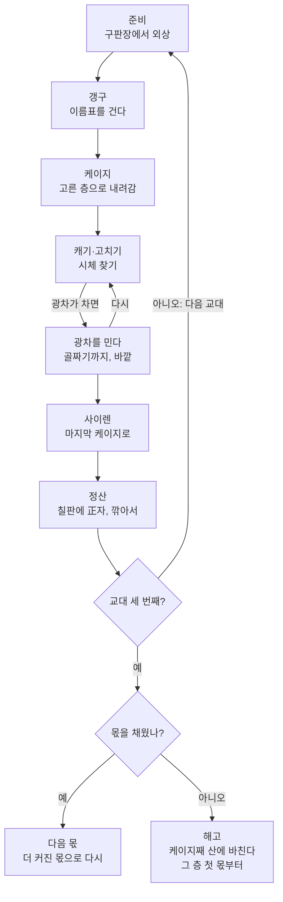
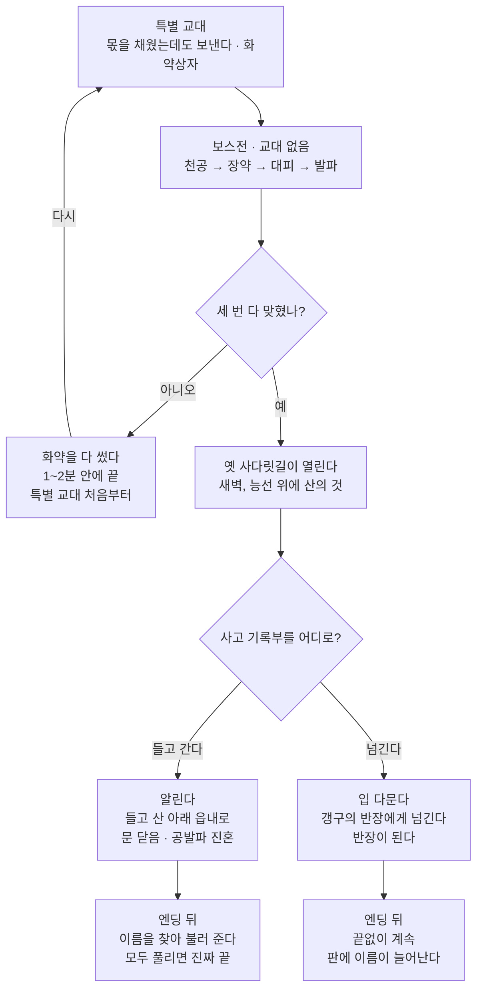
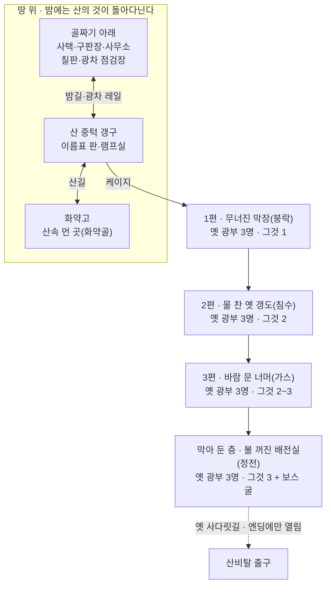
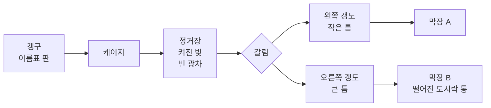
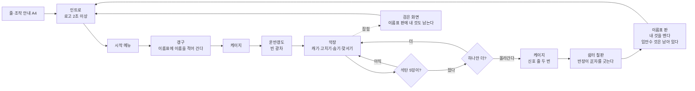
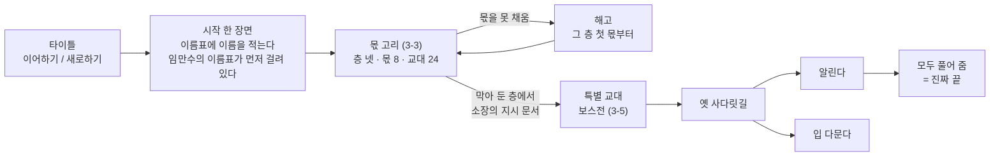
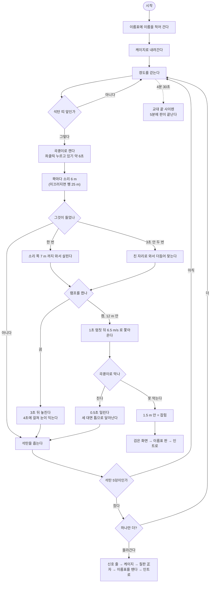
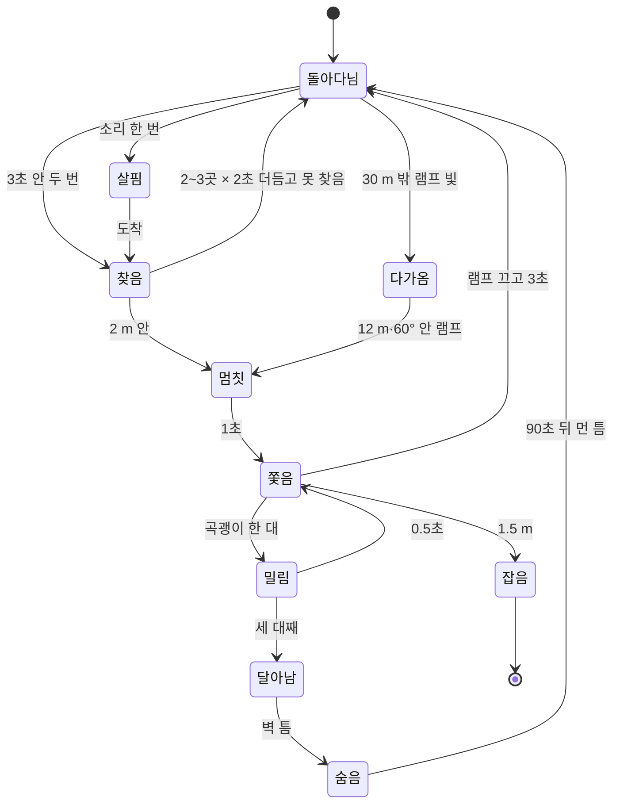

# 막장 — End of the Dead-End · 기획서 (원본)

v3 · 2026-09-28 · **상태: 출시판 뼈대 확정.** 사용자의 출시판 기획서 「막장 출시판 기획 구조안」(09-28, 15쪽)대로 고쳤다 — 그 문서 13쪽 "기존 기획서에서 바뀌는 곳" 표를 전부 옮김. **출시판 개발은 이 문서를 따른다.** "확인 필요"는 Claude 추천값이라 사용자가 아직 체크하지 않은 것이다(9절). 이전 판 v2(09-24, 액자식·주인공 이동수)는 git `e99059b`.

**완성의 기준 (사용자 09-24)**: 게임성과 진행은 **세계관·스토리·플롯·내러티브** 네 가지를 플레이어와 시청자가 이해하고 그 세계에 빠져들면 완성이다. 공포를 주는 연출은 레퍼런스 게임을 보며 채울 수 있다 — 기획서는 네 가지에 힘을 쓴다.

출시판 기획서(사용자가 고치는 문서): https://claude.ai/artifact/VqSUKYCzgujCGwHzcYn1XP · 받은 PDF `C:\Users\anjyo\Downloads\출시판_기획서.pdf`. 이 문서와 그 문서가 다르면 어느 쪽이 맞는지 사용자에게 묻는다. 옛 발표 페이지 https://claude.ai/artifact/1S2degqNkBDmzJVV6edhGt 는 v2(09-24) 그대로다 — 액자식·이동수가 남아 있으니 쓰지 않는다.

이 문서가 저장소의 원본이다. 지스타 제출용 2매(`../지스타2026/02_게임_기획서_초안.md`)는 여기서 뽑는다. 사실은 `조사/` 폴더(01~06, 영상 30편)에서만 가져오고, 줄마다 어느 문서인지 적는다. 게임 수치는 `Tunnel/unity/CLAUDE.md`·`docs/HANDOFF.md`(판정 통과한 것)에서, 출시판 규칙은 출시판 기획서(09-28)에서만 가져온다.

수업(게임기획실무)에서 가져온 틀:
- 스토리텔링 = 이야기 + 플레이어의 행동 + 선택 + 결과 + 변화
- 기획자의 5가지 질문 — 누구의 이야기인가 / 무엇을 원하나 / 왜 / 무엇이 방해하나 / 어떻게 변하나
- 플롯(왜 다음 일이 일어나나 = 인과)과 내러티브(그걸 어떻게 보여 주나)를 나눈다
- 클리프행어 — 가장 궁금한 순간에 끊는다
- 창조가 아니라 발견·재배치 — 소재를 많이 알아야 한다, 핍진성(그럴듯함)을 지킨다
- 만들 도표: 유저 플로우(전체 경험 흐름) · 인터랙션 다이어그램(시스템 반응 구조) · 플로우 차트 · 전체 구조와 구역 나누기

지킬 것:
- **실제 광업소 이름·실제 사고·실제 사람 이름은 쓰지 않는다.** 가상의 광업소로 하고, 실제에서는 풍습·작업 순서·환경만 가져온다(유족과 광부에 대한 예의).
- 지스타 부스판은 전체 이용가 — 시신·피를 보이지 않는다(`../지스타2026/00_운영지침_분석과_일정.md` 2절). 출시판의 시체·바깥·목소리·해고는 부스판에 넣지 않는다(지스타 2매 4절).
- 핵심 문장 **"소리를 내야 돈이 벌리고, 소리를 내면 죽는다"** 에 기여하지 않는 것은 넣지 않는다(`CLAUDE.md`).
- **게임 안에서 "할당량"이라는 말을 쓰지 않는다.** 몫, 정산, 칠판이라고만 부른다.
- **화면에 뜨는 글자는 없다.** 종이나 벽에 쓰인 "세계 안의 글자"는 쓴다(2-5).

---

## 0. 한눈에 — 출시판에서 정한 것 (사용자 09-28)

출시판은 Lethal Company(이하 LC)처럼 교대를 되풀이하며 몫을 채우고, 이야기는 The Forest처럼 장소와 물건에 흩어 둔다. 1~4인이 같은 규칙으로 하고, 엔딩까지 약 8시간이다.

| 항목 | 정한 것 |
|---|---|
| 인원 | 1~4인. 혼자 해도, 넷이 해도 같은 규칙으로 진행된다 |
| 게임 진행 | LC식 반복. 교대(약 15분)마다 내려가 캐고, 교대 세 번마다 몫을 검사한다 |
| 이야기 전달 | The Forest식. 시작 한 장면과 장소·물건에 흩어진 이야기. 안 읽어도 게임은 된다. 액자식은 뺀다 |
| 몫을 못 채우면 | 해고 = 회사가 케이지째 산에 바친다. 그 층의 첫 몫부터 다시. 돈·장비·몫은 처음으로, 찾은 유품과 이름표는 남는다 |
| 몫을 LC와 다르게 | 광차 수를 正자로 센다 · 회사가 깎는다 · 다른 조와 같은 칠판에 적힌다 · 외상으로 시작한다 |
| 몫이 오르는 진짜 이유 | 못 채우는 조가 나오게 하려는 회사의 덫. 마지막에 밝혀진다 |
| 흑막 | 귀령광업소. 사고를 숨기려 막았고, 막은 뒤 광맥이 좋아졌고, 다시 나빠지면 일부러 사람을 보낸다 |
| 괴물에게 잡히면 | 시체만 생긴다. "사람이 먹히면 광맥이 좋아진다"는 이야기로만 보여 주고 게임 규칙에는 없다 |
| 죽음 | 그 교대는 관전. 다음 교대에 새 신입으로 들어온다. 옛 몸을 한 교대 안에 못 데려오면 그 번호를 단 그것이 된다 |
| 죽은 사람의 목소리 | 산 사람에게 안 들린다 |
| 목소리 채팅 | 괴물이 듣는다 |
| 주인공 이름 | 플레이어가 이름표에 자기 이름을 직접 적는다. 부스판도 같다 |
| 끝 | 있다. 가장 깊은 곳의 보스를 쓰러뜨리면 엔딩, 엔딩 뒤에도 계속할 수 있다 |
| 보스 | 회사가 처음 막아 버린 조. 발파 세 번에 쓰러진다. 보스전에는 교대가 없다 |
| 보스전 실패 | 화약 셋을 다 쓰고도 못 잡으면 1~2분 안에 끝나고, 특별 교대 처음부터 다시 |
| 이야기를 따라온 보상 | 임만수가 숨긴 화약 한 개 + 태엽 자명종 |
| 탈출 | 세 번째 발파 뒤에 드러나는 옛 사다릿길로 걸어서 |
| 엔딩 | 알린다 / 입 다문다. 물건(사고 기록부)으로 고른다. 알린다 뒤 모든 그것을 풀어 주면 진짜 끝 |
| 새로하기 | 전부 처음부터 |
| 바깥 괴물 | 산의 것. 죽일 수 없고, 알린다 엔딩에서 물러난다 |
| 맵 흐름 | 골짜기 아래 → 산 중턱 갱구 → 케이지 → 층 넷 |
| 시체와 그것 | 시체 = 아직 그것이 안 된 사람. 몸이 산에 남으면 그것이 된다. 그것은 진혼으로만 풀린다 |
| 옛 광부 | 12명, 한 사람당 수첩 4장. 세부 내용은 스토리를 넣는 단계에서 |
| 임만수 | 유품과 수첩만 남는다. 핵심 힌트 수첩이 층마다 1~2장 |
| 엔딩까지 | 약 8시간 |

---

## 1. 조사에서 찾은 재료 — 발견과 재배치

조사하고 알게 된 가장 큰 것: **핵심 문장은 우리가 지어낸 규칙이 아니라 실제 광부들이 살던 규칙이었다.** 광부는 캔 만큼 돈을 받았고(도급제), 갱 안에서는 휘파람도 뛰기도 금지였다 — 굴이 무너지는 소리를 부른다고 믿어서.

오른쪽 칸 "게임에서 쓸 자리"는 제안이다. 아직 만들기로 정한 것이 아니다.

### 소리

| 찾은 사실 | 출처 | 게임에서 쓸 자리 (제안) |
|---|---|---|
| 갱 안에서 휘파람·뛰기 금지 — 굴이 무너지는 소리를 부른다고 믿었다 | 조사 01·02, 영상 10·16 | 핵심 문장의 실제 뿌리. 설명 글 대신 갱구 벽 표어 한 장 |
| 캔 만큼 받는 도급제, 광차 1톤을 0.8~0.9톤으로 깎아 셈(부비끼) | 조사 01 | "소리를 내야 돈이 벌리고"의 실제 뿌리 |
| 무너지기 전 동발(갱도 받침 기둥)이 먼저 운다 · 땅이 눌러 동발이 휘면 "짐이 온다" | 조사 02, 영상 10 | 괴물 말고 두 번째 경고 소리 — 나무 기둥이 갈라지는 소리 |
| 무너지기 전 천장에서 고운 탄가루가 떨어진다 — "이슬이 온다" | 조사 01·02·05 | 램프 빛 속에 떨어지는 가루 = 눈으로 보는 경고 |
| 칠레 붕괴의 소리 순서: 총소리 같은 소리가 잦아짐 → 우지끈 두 번 → 천둥 → 며칠 정적 → 먼 드릴 소리가 매시간 커짐 | 영상 20 | 무너짐 연출의 순서표 |
| 한국 막장 붕괴를 찍은 장면: "뜨겁다" 외침 → 동발 사이로 탄이 쏟아짐 → 가는 탄이 램프 빛 속으로 물줄기처럼 흘러내림 → 덮침 → 동발에 끼운 나무판까지 내려앉음 | 영상 06 | 무너짐 연출의 눈으로 보는 순서 |
| 착암기 소리에 사람 목소리가 묻힌다. 발파 전에 "발파 5초 전"을 외친다 | 영상 05·01, 조사 01 | — |
| 광부 아내는 빈 도시락 통이 달그락거리는 소리로 남편이 살아 온 것을 알았다 | 영상 27 | 한 판이 끝나는 소리 |
| 사택 스피커 음악이 뚝 끊기면 사고 · 밤에 울리는 구내전화 = 사고 소식 | 조사 01, 영상 10 | 인트로·결과 화면의 소리 |

### 빛

| 찾은 사실 | 출처 | 게임에서 쓸 자리 (제안) |
|---|---|---|
| 운반갱도(레일이 있는 큰 갱도)엔 주황 전등, 비탈 막장과 막장은 머리 램프뿐 | 조사 03, 영상 10·03 | 레벨 설계서 Step 5 "켜진 빛 / 죽은 등 / 완전 어둠" 셋과 그대로 맞는다 |
| 1956년 막장 밝기는 촛불 3~20개 정도. 석탄은 빛을 4% 만 되돌린다. 램프를 끄면 코에 댄 손도 안 보인다 | 조사 05 | 램프를 끄면 거의 아무것도 안 보이는 근거 |
| 어두운 갱도 멀리서 램프 불빛 십여 개가 사람 몸보다 먼저 다가온다 · 램프가 얼굴 반쪽만 비춘다 | 영상 09·23 | 괴물 "눈 두 점"과 같은 보이는 방식 |
| 안전등 신호: 고개를 위아래로 = "이리 와", 좌우로 = "오지 마" | 조사 03 | — |
| 발파 뒤 먼지 때문에 램프가 소용없고 화면이 하얗게 된다 | 영상 01·07·11 | — |
| 1994년 가스 사고 생존자: 새카만 연기 속에서 **레일을 발로 짚으며** 케이지까지 갔고, 작은 빨간 불이 구조대였다 | 영상 01 | 레벨 설계서 Step 2 "레일 = 돌아가는 단서"의 실제 증언 |

### 공간

| 찾은 사실 | 출처 | 게임에서 쓸 자리 (제안) |
|---|---|---|
| 갱구 → 수갱 케이지(세로 굴 승강기)·사갱 → 운반갱도(폭 3.3 · 높이 2.7 m, 레일, 옆에 물도랑) → 층("-300M" 표지) → 비탈 막장(기어 오름) → 막장(높이 1.8~2.4 m) → 버린 옛 갱도(가스가 고임) | 조사 03, 영상 11 | 4절 맵 구조의 뼈대 |
| 갱도는 물 흐르는 방향을 따라 이어진다 — "길을 잃으면 물길을 거슬러 나와라" | 조사 01·03 | 레일 말고 두 번째 돌아가는 단서 |
| 갱도 입구·갈림길마다 층 이름, 갈래 이름, 갱구·수갱에서의 거리 표지(예: "437ML 1,262M") · 쇠 아치에 흰 페인트 번호 | 영상 10·06·17 | 글자가 아니라 세계 안 물건으로 된 길 안내 |
| 바람 문(풍문)은 항상 닫아 둔다 | 조사 03 | — |
| 버린 갱도는 물이 차오르고 레일에 녹물·주황 찌꺼기 | 영상 03·12 | 가장 깊은 구역의 모습 |
| 동발에 큰 호박만 한 곰팡이, 흰 솜 같은 것이 늘어짐 · 쥐가 도시락을 파먹어 천장에 매단다 | 조사 03, 영상 01·03·11 | 쉼터의 소품 |

### 몸

| 찾은 사실 | 출처 | 게임에서 쓸 자리 (제안) |
|---|---|---|
| 깊은 막장은 30~38도, 습도 90% — 한겨울에도 덥다 | 조사 05 | 지친 자세(UI-1b 헐떡임)의 이유 |
| 1 km 내려가도 기압은 수영장 1.2 m 수준 — 무서운 건 압력이 아니라 열·돌·가스 | 조사 05 | 깊이에 따라 바꿀 것은 더위와 공기이지 귀 먹먹함이 아니다 |
| 비탈 막장은 동발(60~80 kg)을 지고 엎드려 기어 올랐다 | 조사 02, 영상 14 | 숙이기 |
| 무너지면 굴 안에선 도망갈 데가 없어 엎드린다 | 영상 30 | — |

### 사람과 풍습

| 찾은 사실 | 출처 | 게임에서 쓸 자리 (제안) |
|---|---|---|
| 한 조 = 숙련공(선산부) 1 + 보조(후산부) 2. "후산부 목숨은 선산부 손에" | 조사 01 | 2절 이야기의 인물 |
| 갱구 벽에 이름표를 걸고 들어간다 | 조사 01·03 | 시작과 끝 장면 |
| 출근 때 "다녀오겠다"고 하지 않는다 · 들어갈 때 뒤돌아보지 않는다 · "오늘도 무사히" | 조사 01, 영상 04·28 | — |
| 사람이 죽은 막장에 다시 들어갈 때 철판을 두드리며 죽은 동료의 이름을 불러 "같이 나가자" | 조사 01 | 2-2 세계의 규칙 3(진혼) |
| 쥐는 잡지 않는다 — 사고 전에 입구 쪽으로 도망가서 광부들이 따라 피했다 | 조사 01, 영상 16 | — |
| 광차 하나를 더 채우려고 혼자 남았다가 천장에 깔렸다(미국 광부 가족 이야기) | 영상 24 | 부스판 「하나만 더」의 제목 |

---

## 2. 이야기 — 후보 셋 (09-24 기록)

**결정**: 부스판 한 판 = 후보 A 「하나만 더」(09-24). 출시판은 A 의 첫 교대에서 시작해 LC식 교대·몫으로 이어진다(0절, 3절). 후보 B 의 진혼은 세계의 규칙 3(2-2)과 알린다 엔딩(2-6)으로 들어갔다. 후보 C 는 쓰지 않는다. 아래 B·C 는 고른 과정의 기록이다.

셋 다 같은 조작(캔다 → 들린다 → 숨는다 → 맞선다 → 돌아온다)을 쓴다. 다른 것은 **왜 캐는지, 무엇을 두고 나오는지**다.

### 후보 A 「하나만 더」 — 신입 후산부의 첫 교대 (채택 = 부스판)

| 질문 | 답 |
|---|---|
| 누구의 이야기인가 | 신입 후산부. 이름은 플레이어가 이름표에 적는다. 첫 밤 교대(병방, 밤 12시~아침 8시) |
| 무엇을 원하나 | 몫을 채운다 — 석탄을 캐서 광차를 채운다 |
| 왜 | 캔 만큼 받는다. 장비는 구판장 외상이라 몫은 곧 빚 갚기다 |
| 무엇이 방해하나 | 선산부 임만수가 막장에서 돌아오지 않았다. 곡괭이 소리가 돈인데 그 소리를 듣고 어둠 속의 그것이 온다. 동발이 운다 |
| 어떻게 변하나 | 석탄을 세던 사람 → 석탄을 두고라도 살아서 올라오는 사람 |

- 플롯(인과): 캐야 돈 → 캐면 소리 → 소리에 그것이 옴 → 숨거나 맞섬 → 더 캘지, 지금 올라갈지 고름 → 케이지.
- 내러티브(보여 주는 법): 화면 글자 없음. 갱구 이름표 판, 기둥의 "오늘도 무사히", 막장에 떨어진 임만수의 도시락 통, 칠판, 소리.
- 클리프행어: 케이지가 올라와 이름표 판 앞에 서면 — 임만수의 이름표가 아직 걸려 있다. 판이 끝난다.
- 좋은 점: 핵심 문장과 한 글자도 안 부딪친다. 괴물이 광부 모양 몸이라 "저게 임만수인가?"라는 물음이 저절로 생긴다. 부스 한 판 3~5분에 들어간다.
- 어려운 점: 괴물이 누구인지 끝까지 말하지 않아야 한다. 말하는 순간 끊긴 이야기가 풀린다.

### 후보 B 「이름을 부르러」 — 진혼 (기록)

| 질문 | 답 |
|---|---|
| 누구의 이야기인가 | 20년 차 선산부. 한 달 전 무너짐 때 후산부를 막장에 두고 혼자 나왔다 |
| 무엇을 원하나 | 그 막장에 다시 들어가 풍습대로 철판을 두드리며 이름을 부르고 "같이 나가자"고 한다 |
| 왜 | 갱구 판에 그 후산부의 이름표가 아직 걸려 있다. 데리고 나와야 뗄 수 있다 |
| 무엇이 방해하나 | 막장의 그것은 소리를 듣는다. 이름을 부르는 것 자체가 소리다 |
| 어떻게 변하나 | 도망쳐 나왔던 사람 → 끝까지 부르는 사람 |

- 좋은 점: "소리를 내야 한다"가 가장 강하게 이야기가 된다. 한국 탄광에만 있는 풍습이다.
- 어려운 점: 핵심 문장의 "돈"이 "사람"으로 바뀐다 — 광석을 캐는 이유가 약해진다. 죽음을 정면으로 다뤄 전체 이용가 문의가 더 필요하다.

### 후보 C 「마지막 교대」 — 문 닫기 전날 (기록)

| 질문 | 답 |
|---|---|
| 누구의 이야기인가 | 문 닫기 전날 마지막 밤 교대에 남은 광부 |
| 무엇을 원하나 | 마지막 몫을 채우고 자기 이름표를 떼고 나간다 |
| 왜 | 내일이면 광업소가 닫힌다. 이 일로 자식을 키웠다 |
| 무엇이 방해하나 | 전등이 하나씩 꺼진 갱도, 차오르는 물, 그리고 오래 여기 남아 있던 것 |
| 어떻게 변하나 | 떠나는 사람 → 기억하는 사람 |

- 좋은 점: 2024·2025년 실제 폐광과 이어져 그럴듯하고 지금 이야기다. "전등이 꺼져서"가 어둠의 이유가 된다.
- 어려운 점: "여기 남아 있던 것"이 실제 폐광 광부에게 무례하게 읽힐 수 있다(가상 광업소로 해도).

### 2-1. 부스판 한 판 「하나만 더」

배경: 1988년 강원도의 가상 탄광(2-2). 나무 동발과 전기 캡램프를 쓰던 때(조사 01·03).

**부스판 = 출시판의 첫 교대를 혼자, 1편의 한 조각에서, 3~5분으로 줄인 것.** 맵·규칙은 지금 빌드 그대로 두고 이름 짓기만 바꾼다 — 이름표에 플레이어가 자기 이름을 적는다, 기본 이름은 없다(사용자 09-28, 지스타 2매 제출 때). 시체·바깥·목소리·해고는 넣지 않는다(전체 이용가, 줄 관리).

#### 한 판 따라가기 (약 4분)

1. **갱구, 밤 (0:00~0:20)** — 갱구 벽의 이름표 판. 이름표에 내 이름을 적어 빈 칸에 건다. 바로 옆 칸에 선산부 임만수의 이름표가 먼저 걸려 있다 — 한 시간 먼저 들어갔다. 기둥에 "오늘도 무사히". 램프를 켠다.
2. **케이지 (0:20~0:40)** — 철창 승강기. 신호 벨이 두 번 울리면 내려간다(실제 신호: 한 번 정지, 두 번 출발 — 조사 03). 쇠줄 감기는 소리, 철창 너머로 층 표지가 올라간다.
3. **운반갱도 (0:40~1:00)** — 주황 전등이 이어지고 레일 옆으로 물이 흐른다. 빈 광차 하나가 서 있다 = 오늘 채울 몫. 여기까지는 밝고 조용하다.
4. **막장 쪽 (1:00~3:30)** — 전등이 끝나고 머리 램프뿐. 막장 입구 바닥에 임만수의 도시락 통이 떨어져 있다. 뚜껑이 열렸고 밥이 그대로다 — 점심 전에 무슨 일이 있었다. 석탄을 캐면 소리가 갱도를 울리고, 멀리서 무언가 움직인다. 동발이 삐걱 운다. 램프를 끄면 어둠 속에 빛 두 점.
5. **고르기** — 석탄 5덩이를 광차에 실으면 몫이 찬다. 그때부터 케이지로 돌아갈 수 있다. 더 실을수록 받을 돈은 오르지만(도급), 하나 더 캘 때마다 그것이 더 자주, 더 가까이 온다. "하나만 더"를 할지 지금 올라갈지는 플레이어가 고른다.
6. **끝 (~4:00)** — 신호 줄을 두 번 당겨 올라간다. 반장이 쉼터 칠판에 우리 조의 광차를 正자로 긋는다(화면 숫자 없이). 이름표 판 앞에서 내 이름표를 뗀다. **임만수의 이름표는 그대로 걸려 있다** — 여기서 끊는다.
   - **잡혔을 때** — 검은 화면 뒤 이름표 판. 내 이름표도 임만수 옆에 걸린 채 남아 있다. 피나 시신 없이 "돌아오지 못했다"를 보여 준다.

- 플레이어에게 말하지 않는 뒤편: 임만수는 몫을 채웠는데도 "특별 교대"로 보내졌다(2-3). 부스판에서는 말하지 않는다.
- 괴물: 광부 모양 몸이 서서 걷는다. 게임은 그것이 임만수인지 말하지 않는다. 플레이어가 도시락 통·이름표·괴물의 몸을 보고 스스로 짐작한다. 짐작이 맞는지 알려 주지 않고 끊는 것이 클리프행어.
- 변화는 말로 알려 주지 않는다. "하나 더"를 누르거나 멈추는 플레이어의 손이 변화다.
- 이미 있는 것: 캐기, 소리를 듣는 괴물(의심·수색·추격·잡기), 램프와 어둠 적응, 곡괭이 치기·던지기·부러짐, 발소리, 인트로와 잡힌 뒤 인트로 복귀, 고칠 곳(REP-1).
- 새로 만들 것: 이름표에 이름 적기(입력 시간 · 안 적고 넘기려는 사람 처리는 제안서로), 갱구 이름표 판(시작·끝·잡힘에 세 번 쓰임), 케이지, 광차에 석탄 싣기, 쉼터 칠판 正자, 도시락 통 소품, 교대 끝 사이렌.
- 걱정: 괴물 정체를 말하고 싶어질 때 참아야 한다. 관람객이 4분 안에 알아채려면 이름표 판이 시작과 끝에 두 번 보여 비교가 돼야 한다.
- 전시 뒤: 출시판(3절) — 몫을 채우고 임만수를 찾아 층을 내려간다.

#### 후보 B 「이름을 부르러」 — 한 판 따라가기 (09-24 기록)

뒤편: 한 달 전 막장이 무너질 때 선산부는 무너지는 소리에 먼저 뛰었고, 뒤에 있던 후산부는 나오지 못했다. 광업소는 구조를 멈추고 그 막장을 바람 문으로 막았다.

1. **갱구** — 이름표 판에 후산부 이름표가 한 달째 걸려 있다. 내 이름표를 그 옆에 건다.
2. **케이지, 운반갱도** — A 와 같다.
3. **막아 둔 옛 막장** — 바람 문을 열고 들어간다. 전등 없음, 레일에 녹물, 발목까지 물(영상 03·12).
4. **할 일** — 막장 안에 슈트 철판(탄이 미끄러져 내려가는 철판)이 세 군데. 곡괭이로 철판을 두드리면 소리가 갱도 끝까지 울린다(실제 풍습: 이름을 부르며 철판을 두드린다 — 조사 01). 두드리면 어딘가에서 "똑, 똑" 대답이 돌아온다 — 다음 철판이 있는 쪽. 대답을 따라가야 한다. 그런데 두드리는 소리는 그것도 부른다. 곡괭이 캐기는 "무너진 곳을 파서 길을 여는 일"로 바뀐다. 돈은 없다.
5. **마지막 철판** — 세 번째를 두드리면 대답이 바로 등 뒤에서 들린다(클리프행어).
6. **끝** — 케이지로 돌아와 후산부의 이름표를 뗀다. 데리고 나왔는지는 말하지 않는다. 아무도 안 당겼는데 신호 벨이 한 번 더 울린다.
   - **잡혔을 때** — 두 이름표가 나란히 남는다.

- 괴물: 거의 대놓고 후산부를 떠올리게 한다. 대답하는 두드림이 그것인지 후산부인지 모른다.
- 새로 만들 것: 철판 두드리기, **대답하는 두드림 소리가 방향을 알려 주는 장치(새 시스템)**, 막아 둔 옛 막장 구역(물·녹), 등 뒤 대답 연출.
- 핵심 문장이 바뀐다: "소리를 내야 데려오고, 소리를 내면 죽는다". `CLAUDE.md` 의 기능 판정 기준을 고쳐야 하고, 돈 쪽 계획(곡괭이는 상점에서 산다 — UI-1a 결정)이 붕 뜬다.
- 걱정: 10/17 빌드까지 새 장치를 만들고 판정받아야 한다. 죽은 동료를 부르는 게 중심이라 전체 이용가 문의에서 A 보다 걸릴 수 있다. 풍습을 모르는 관람객에게 30초 안에 "왜 철판을 두드리지?"가 전해지기 어렵다.

#### A 와 B 나란히 (09-24 기록)

| | A 하나만 더 | B 이름을 부르러 |
|---|---|---|
| 핵심 문장 | 그대로 | "돈"이 "사람"으로 바뀜 |
| 새로 만들 것 | 이름표 판·광차 싣기·소품 하나 | 위 + 대답하는 두드림 장치·옛 막장 구역 |
| 30초 안에 전해지나 | "캐면 온다"가 바로 | 풍습 설명이 필요할 수 있음 |
| 남는 감정 | 궁금함 (선산부는 어디에?) | 슬픔·죄책감 |
| 전체 이용가 | 쉬움 | 문의 필요 |
| 전시 뒤 이어짐 | 선산부를 찾는 다음 교대 | — |

---

## 2-2. 세계관

수업의 정의: 세계관은 배경 그림이 아니다(월드빌딩) — 그 세계의 규칙·역사·장소·사람. 관심을 가지면 행동하게 된다.

### 한 줄

**산은 소리를 듣는다. 몸이 산에서 나오지 못한 사람은 산에 남아, 살아 있던 때의 버릇대로 움직인다.**

### 때와 곳 — 1988년, 강원도의 가상 탄광 「귀령(耳嶺, 귀 고개)광업소」

- 산은 소리를 듣고, 몸이 산에서 나오지 못한 사람은 산에 남는다. 실제 광업소·사고·사람 이름은 쓰지 않는다.
- 이듬해(1989) 석탄산업 합리화로 탄광 대부분이 문을 닫는다(1988년 347곳 → 1996년 11곳, 조사 01). 그래서 회사는 닫기 전에 한 톤이라도 더 캐려 하고, 사고는 적지 않으려 한다 — **이 회사의 속셈은 설정(지어낸 것)이다.** 실제 광업소 이야기가 아니다.
- 1988년은 진폐로 죽은 광부(212명)가 사고로 죽은 광부(159명)보다 많아진 해다(조사 02).
- 전기 캡램프, 나무 동발, 기어 오르는 비탈 막장이 아직 남아 있던 때(조사 03·05). 헤드램프 하나로 걷는 우리 게임과 맞는다.

### 세계의 규칙 다섯

1. **산은 소리를 듣는다.** 갱 안에서 휘파람·뛰기를 금한 것은 미신이 아니었다(조사 01·02).
2. **몸이 산에서 나오지 못한 사람은 산에 남는다.** 몸을 밖으로 데려 나오는 것이 곧 "같이 나가자"가 이루어지는 것이다.
3. **산에 남은 넋은 이름을 불러 주어야 나간다 — 진혼.** 실제 풍습이다. 죽은 동료의 이름을 부르며 철판을 두드려 "나가자"고 달랬고, 화약으로 소리만 내는 공발파를 한 광업소도 있었다(조사 01). (v2 의 규칙 4 "이름을 불러 주면 —"을 진혼으로 확정, 09-28)
4. **남은 넋(그것)은 살아 있던 버릇대로 움직인다.** 소리를 부름으로 알고 오고, 불빛을 동료로 알고 따르고, 어둠에선 벽을 더듬는다. 산 사람을 "같이 나가자"며 붙잡지만, 잡힌 사람도 산에 남는다.
5. **산은 사람을 받으면 탄을 준다.** 이야기로만 드러나고, 게임 규칙에는 없다.

이미 만든 괴물의 행동을 실제 광부의 버릇에 대어 보면 맞는다 — **괴물의 행동은 새로 지어낸 것이 아니라 광부의 버릇이 뒤틀린 것**(규칙 4):

| 이미 만든 괴물의 행동 | 실제 광부의 버릇 (조사) | 이 세계의 설명 |
|---|---|---|
| 소리가 나면 그쪽으로 온다 | 갇힌 광부는 두드려서 구조를 불렀고(조사 02 새고, 영상 20), 산 사람은 죽은 동료의 이름을 부르며 철판을 두드렸다(조사 01) | 소리를 "누가 나를 부른다"로 알아듣고 찾아온다 |
| 켜진 램프에 다가온다 | 어둠에서는 사람 몸보다 동료의 불빛이 먼저 보였고(영상 09), 연기 속 작은 빨간 불이 구조대였다(영상 01) | 불빛을 동료로 알고 따라온다 |
| 손으로 바닥·벽을 더듬어 찾는다 | 발파 바람에 등불이 꺼지면 벽을 더듬으며 기어 다녔다(조사 05) | 불이 꺼진 채 남은 몸의 버릇 |
| 곡괭이에 맞으면 움찔하고 벽 틈으로 물러난다 | 무너진 막장 = 갇혔던 곳 | 사람이었던 몸. 돌아가는 곳은 무너진 틈 |
| 붙잡는다 | 진혼 때 "같이 나가자"고 불렀다(조사 01) | 같이 나가자고 붙잡지만 그들은 나갈 수 없다. **잡힌 사람도 산에 남는다** — 몸을 한 교대 안에 못 데려오면 그 번호를 단 그것이 된다(3-4) |
| 어둠 속 눈 두 점 | 1970년대 캡램프는 보조 불빛이 2개였다(조사 05) | (해석 하나) 꺼져 가는 램프의 두 불빛일 수도 있다. 정하지 않는다 |

### 네 겹

| | 무엇인가 | 어디에 | 어떻게 되나 |
|---|---|---|---|
| 시체 | 아직 그것이 되지 않은 사람의 몸 | 갱도 곳곳 | 밖으로 데려 나오면 그것이 되지 않는다. 돈·이름표·유품을 받는다 |
| 그것 | 몸이 끝내 산에서 나오지 못한 사람의 넋. 산이 사람보다 큰 몸을 입혔다 | 갱도 | 진혼(이름을 부르고 공발파)으로만 풀린다. 이름을 아는 그것만 풀린다 |
| 보스 | 회사가 처음 막아 버린 조 전체의 넋 | 막아 둔 막장 | 발파 세 번에 쓰러진다 |
| 산의 것 | 넋을 먹고 탄을 내주는 산 그 자체. 듣는 산 | 밤의 산비탈, 마당, 화약골 | 죽일 수 없다. 건물에 숨어 피한다. 먹이가 끊기고 진혼이 치러지면 물러난다 |

### 회사의 비밀

- 어느 해 가장 깊은 막장이 무너져 한 조가 갇혔다. 회사는 사고를 숨기려 구조를 멈추고 그대로 막았다. 기록에는 "사고 없음".
- 막은 뒤 광맥이 좋아졌다. 시간이 지나 다시 나빠지면, 몫을 못 채운 조를 일부러 그 막장으로 보냈다.
- 몫이 계속 오르는 진짜 이유는 못 채우는 조가 나오게 하려는 것이다. **게임의 기본 규칙이 곧 회사의 덫이다.**
- **모든 것을 묶는 고리**: 회사가 사고를 기록하지 않았다 → 사고가 없었으니 진혼도 없었다 → 아무도 이름을 불러 주지 않았다 → 그 넋들이 그것이 됐다. 회사가 괴물을 만든 원인은 "기록을 지운 것"이다.
- 배경: 1988년은 이듬해 석탄산업 합리화로 탄광 대부분이 문을 닫기 직전이다(조사 01). 이 회사의 속셈은 지어낸 설정이며 실제 광업소 이야기가 아니다.

### 사람들

| 누구 | 무엇 | 조사 근거 |
|---|---|---|
| 주인공 (플레이어) | 신입 후산부. 이름표에 자기 이름을 직접 적는다(부스판도 같다) | 조사 01 |
| 선산부 **임만수** | 이름 만수(萬壽) = "오래 살라" — 그 이름의 사람이 막장에 남는다. 몫을 채웠는데도 "특별 교대"로 보내져 유품과 수첩만 남는다. 핵심 힌트 수첩이 층마다 1~2장 | 조사 01 |
| 반장 | 흰 안전모('백바가지'). 회사 쪽. 몫과 단가를 정하고 사고를 적지 않는다. 쉼터 칠판에 正자를 긋고, 해고 때 이름표를 난로에 넣는다. 첫 몫부터 흰 안전모를 쓰고 있다(입 다문다 엔딩의 씨앗) | 조사 01 |
| 소장 | 막아 둔 층에 지시 문서를 남겼다 — "알고 한 짓이다" | (설정) |
| 옛 광부 12명 | 층마다 3명. 한 사람당 수첩 4장, 유품, 시체. 이름·사연·수첩 문장은 스토리를 넣는 단계에서 | (설정) |
| 다른 조들 (NPC) | 칠판에 줄이 있다. 몫을 못 채운 조는 다음 교대에 칠판에서 지워지고, 이름표 판에는 이름표가 남는다 | (설정) |
| 사택의 가족 | 도시락을 싸 주고, 출근하면 신발을 방 안쪽으로 돌려놓는다. 얼굴은 안 나온다 — 소리와 물건만 | 조사 01, 영상 27 |
| 그것들 | 몸이 산에서 나오지 못한 광부들의 넋. 안전모 번호가 저마다 다르다 | — |

### 돈 — 게임의 경제가 실제 구조를 따른다

- 실제: 캔 만큼 받는다(도급), 광차 무게를 깎아 센다(부비끼), 월급 대신 쌀 전표, 광업소 신분증으로 가게 외상(조사 01).
- 게임: 몫 = 칠판에 正자로 긋는 광차 수. 회사는 광차 1톤을 0.8~0.9톤으로 세고, 돌이 섞이면 더 깎는다. 장비는 구판장 외상으로 시작한다 — 몫은 곧 빚 갚기. 옛 광부의 몸을 데려오면 수습 수당, 잡힌 동료의 몸을 두고 오면 "신입 들이는 비용"을 크게 깎는다(3-4). **소리를 내야 빚을 갚는다.**
- 값(몫의 크기, 단가 인상 폭, 벌금, 수습 수당)은 나중에 정한다(9절).

## 2-3. 스토리 — 무슨 일이 있었나 (일어난 순서대로)

스토리는 플레이어가 오기 전에 이미 일어난 일이다.

1. **개광** — 새 갱구를 열며 돼지머리 산신제를 지낸다(조사 01).
2. **큰 붕락** — 가장 깊은 막장에 한 조가 갇힌다. 안에서 두드리는 소리가 나는데도 회사는 구조를 멈추고 막는다. 기록은 "사고 없음". (설정. 실제 사고를 옮긴 것이 아니다)
3. **광맥이 좋아진다** — 나빠질 때마다 몫을 못 채운 조가 그 막장으로 보내진다. 칠판에서 조 이름이 하나씩 지워진다.
4. **1988년** — 합리화를 앞두고 회사가 단가를 올린다. 몫이 커진다.
5. **임만수가 알아챈다** — 선산부 임만수는 몫을 채웠는데도 "특별 교대"로 보내진다. 유품과 수첩만 남는다.
6. **플레이어가 온다** — 신입 후산부로 들어와 이름표에 자기 이름을 적는다. 첫 교대, 갱구 이름표 판에 임만수의 이름표가 먼저 걸려 있다. **(부스 한 판 = 여기)**

## 2-4. 플롯 — 층마다 알게 되는 것

수업의 정의: 플롯은 "왜 다음 일이 일어났나"(인과). 플롯은 플레이어가 층을 내려가며 2-3 의 일을 알아 가는 순서다. **게임을 진행하는 것 자체가 플롯이다.**

인과: 외상으로 시작한다. **그래서** 몫을 채워야 한다. 캐면 소리가 나고, 그것들은 소리를 부름으로 듣는다. 몫을 채우면 몫이 오르고 더 깊은 층이 열린다. **그래서** 더 오래된 그것들과 옛 사고의 흔적을 만난다. **그래서** 회사의 비밀을 알게 된다. 막아 둔 층에서 소장의 지시 문서를 찾으면 회사가 눈치챈다. **그래서** 회사가 우리 조를 특별 교대로 보낸다.

| 층 | 찾는 것 | 알게 되는 것 |
|---|---|---|
| 1편 | 생산 일보: 사고 난 다음 날부터 생산량이 뛴 기록 | "뭔가 이상하다" |
| 2편 | 반장 수첩: 지워진 조 이름 옆에 모두 같은 막장 이름 | "회사가 사람을 보냈다" |
| 3편 | 사고 기록부의 빈 줄, 갇힌 조를 기억하는 동료의 수첩 | "산 채로 막았다. 진혼도 없었다" |
| 막아 둔 층 | 소장의 지시 문서, 임만수의 마지막 수첩 | "알고 한 짓이다" → 특별 교대 |

임만수의 수첩도 같은 순서로 놓인다. 플레이어는 임만수가 알아 간 길을 그대로 밟으며 "이 사람도 나처럼 알아 버렸구나"를 느낀다.

## 2-5. 내러티브 — 어떻게 보여 주나

수업의 정의: 내러티브는 "그것을 나에게 어떻게 이야기해 주나". 같은 플롯도 보여 주는 순서와 눈(시점)에 따라 다른 이야기가 된다.

원칙: **화면에 뜨는 글자는 없다**(UI-1c 판정 통과). 이야기는 물건, 소리, 장소로 전하고, 종이나 벽에 쓰인 "세계 안의 글자"는 쓴다. **The Forest식** — 시작 한 장면과 장소·물건에 흩어진 이야기. 안 읽어도 게임은 된다. 액자식은 뺐다(09-28).

### 시작 한 장면

플레이어가 이름표에 자기 이름을 적는다(부스판도 같다). 갱구 이름표 판에 걸면, 선산부 임만수의 이름표가 먼저 걸려 있다. The Forest의 추락 장면처럼 이 한 장면이 목표(몫을 채우고, 임만수를 찾는다)를 주고, 협동이면 모두 같이 본다.

### 전하는 도구

| 도구 | 전하는 것 | 게임에서 쓸모 |
|---|---|---|
| 이름표 판 (갱구) | 누가 아직 안에 있나 | 걸려 있는 이름표 수 = 저 아래 그것의 수. 글자 없는 위험도 계기판 |
| 칠판 (쉼터·사무소) | 조마다 正자로 센 광차 수, 지워지는 조 | 몫 진행, 회사의 덫 |
| 수첩 | 옛 광부와 임만수의 이야기 | 그것을 피하는 법, 시체가 있는 방향 |
| 유품 | 그 사람이 어떤 사람이었나 | 손에 들고 돌려 보면 사진 뒷면 글씨 등이 보인다 |
| 안전모 번호 | 그것이 누구였나 | 그것마다 번호가 다르다. 모델은 그대로, 그림(텍스처)만 바꾼다 |
| 회사 문서 | 생산 일보, 반장 수첩, 사고 기록부, 소장 지시 문서 | 회사의 비밀(2-4 표). 사고 기록부는 마지막 선택의 물건 |
| 사택 스피커 | 아침 음악 = 무사히 끝난 밤 | 사다릿길 끝에서 들린다 |

그 밖에 09-24 표에서 이어 쓰는 것: 떨어진 도시락 통(부스판 · 보스 굴), 갱도 표지(층·거리 — 영상 10·06), 소리(두드림·동발 울음·쥐의 발소리 — 조사 02).

### 수첩의 틀

옛 광부 12명 × 4장 = 48장에, 임만수의 핵심 힌트 수첩이 층마다 1~2장이다. 한 장은 2~4문장으로 짧게 쓴다. 세부 내용은 스토리를 넣는 단계에서 정한다.

| 장 | 내용 | 놓이는 곳 | 게임에서 쓸모 |
|---|---|---|---|
| ① 일상 | 어떤 사람이었나(가족, 빚, 좋아하던 것) | 쉼터, 사물함 | — |
| ② 버릇 | 특징과 버릇, 함께 일하다 못 나온 동료 이야기 | 일하던 막장 쪽 | 그 동료가 된 그것의 행동 힌트 |
| ③ 이상한 일 | 무엇을 봤나, 무슨 일이 있었나 | 시체로 가는 길 | 시체가 있는 방향 |
| ④ 마지막 | 왜 빠져나갈 수 없었나 | 시체 곁 | 유품과 함께 |

임만수 수첩 예시(가상, 다듬을 것):
- 1편: "3조가 또 칠판에서 지워졌다. 몫을 못 채웠다고 한다. 그런데 그다음 날부터 탄이 유난히 좋다."
- 2편: "반장 수첩을 슬쩍 봤다. 지워진 조 이름 옆에 전부 같은 막장 이름이 적혀 있다. 거기는 막아 둔 곳인데."
- 3편: "그해 막은 날, 안에서 두드리는 소리가 사흘을 났다고 한다. 회사는 그날 사고가 없었다고 적었다."
- 보스 굴(안전등·도시락 통 옆): "반장이 나더러 그 막장으로 가라고 한다. 몫은 채웠는데. 눈치를 챈 건가. … 나는 여기서 무엇을 할 수 있지."

임만수의 마지막 장들은 숨긴 화약과 자명종이 있는 곳을 가리키고, "막장만 막는다고 끝나는 게 아니다. 산이 …"처럼 산의 것을 미리 알린다.

### "그것은 사람이었다"를 알려 주는 순서

1. 1편 수첩에 진혼 풍습을 심는다. 예) "형님 죽은 막장에 들어갈 때 철판 두드리며 이름을 불렀다. 안 부르면 못 나간다더라."
2. 수첩에 적힌 버릇과 그것의 행동이 똑같다. "저게 그 사람이구나."
3. 그것의 안전모 번호가 기록 속 이름과 이어진다.
4. 사고 기록부의 빈 줄: 사고가 없었으니 진혼도 없었다.
5. 알린다 엔딩: 공발파 뒤 그것들이 처음으로 플레이어를 해치지 않고 곁을 지나 갱구 밖으로 걸어 나간다.

## 2-6. 결말 — 셋

끝은 셋이다: **입 다문다 / 알린다 / 알린다 뒤 모두 풀어 줌(진짜 끝).**

- 납득되게 하는 원칙: 선택은 게임 내내 해 온 질문(소리를 낼까, 돈이냐 사람이냐)과 같다. 두 길 모두 대가가 있고, 결과는 엔딩 뒤 게임에서 계속 느껴진다. 협동에서는 메뉴가 아니라 물건으로 고르니 누구든 기록부를 들 수 있다.
- 씨앗: 첫 몫부터 반장이 흰 안전모를 쓰고 있고, 수첩 하나에 진혼과 공발파 이야기가 있다.

| | 알린다 | 입 다문다 |
|---|---|---|
| 고르는 법 | 사고 기록부를 들고 산 아래 읍내 쪽으로 내려간다(확인 필요) | 갱구에서 기다리는 반장에게 넘긴다(확인 필요) |
| 결과 | 광업소가 문을 닫는다. 공발파로 진혼하면 이름을 아는 그것들이 갱구 밖으로 걸어 나간다. 산의 것이 물러난다 | 두툼한 돈 봉투와 반장의 흰 안전모. 이제 내가 몫을 정하고 사람을 보내는 쪽 |
| 대가 | 돈과 일자리를 잃는다 | 이름표 판에 이름이 계속 늘어난다 |
| 엔딩 뒤 | 몫 없이 남은 이름과 유품을 찾아 진혼하는 자유 플레이. 모두 풀면 조용한 갱도 = 진짜 끝 | LC처럼 끝없이 계속. 그것들과 산의 것은 그대로 |

저장: 이어하기 / 새로하기. 새로하기는 전부 처음부터. 협동은 호스트의 세계에 들어온다(The Forest와 같은 방식, 확인 필요).

## 2-7. 정한 것

09-24 (v2):
1. 때 = **1988년**
2. 그것들의 정체 = **결말에서 밝힌다**. 부스와 앞 부분은 짐작만. (09-28: 수첩·안전모 번호로 층마다 조금씩 — 2-5 "그것은 사람이었다" 순서)
3. ~~보여 주는 순서 = 액자식~~ → **액자식 삭제(09-28).** The Forest식, 세계 안의 글자 허용(2-5)
4. 결말 = ~~이름을 부르는 끝 / 캐고 나가는 끝~~ → **알린다 / 입 다문다 + 진짜 끝(09-28, 2-6)**
5. 이름 = **귀령광업소**(耳嶺, 귀 고개 — "산은 소리를 듣는다". 소리로는 鬼靈으로도 읽힌다) · 선산부 **임만수**. **주인공 이름은 플레이어가 이름표에 적는다(09-28) — "이동수"는 뺐다.** 부스판도 기본 이름 없이 적는다(사용자 09-28). 광업소 이름은 09-24 다시 검색 — 같은 이름의 실제 광업소 없음. (후보였던 "흑령"은 북한에 실제 흑령탄광이 있어 뺐다)

09-28 (출시판 기획서): 0절 표 전부.

---

## 3. 전체 구조 — 게임 진행

표기: **판정 통과** = 실행 파일로 사용자 판정을 받은 수치(`HANDOFF.md`). **제안** = 아직 안 만든 것. **확인 필요** = Claude 추천값, 사용자 체크 전(9절).

### 3-1. 교대와 몫

한 판은 교대 하나(약 15분)이고, 교대 세 번마다 몫을 검사한다. 리듬은 LC와 같지만, 몫을 세고 깎고 보여 주는 방식은 1988년 탄광식이다. (v2 의 "액자와 본편" 도표는 뺐다 — 액자식 삭제)

광차는 교대 중에 여러 번 골짜기까지 밀고 내려간다. 그때마다 바깥(산의 것)을 지난다.

**몫을 LC와 다르게 하는 네 가지**

| 방식 | 게임에서 | 근거 |
|---|---|---|
| 광차 수로 센다 | 반장이 쉼터 칠판에 분필로 正자를 긋는다. 화면 숫자 없음 | 쉼터 벽 분필 숫자(영상 11) |
| 회사가 깎는다 | 광차 1톤을 0.8~0.9톤으로 셈. 돌이 섞이면 더 깎음 | 부비끼(조사 01) |
| 다른 조와 같이 적힌다 | 칠판에 NPC 조들의 줄이 있다. 몫을 못 채운 조는 다음 교대에 칠판에서 지워지고, 이름표 판에는 이름표가 남는다 | "몫이 덫"을 글자 없이 보여 줌 |
| 외상으로 시작한다 | 장비는 구판장 외상. 몫은 곧 빚 갚기 | 쌀 전표, 구판장 외상(조사 01) |

**그 밖의 규칙**

- **소리**: 캐기, 고치기, 시체 옮기기, 광차 바퀴, 목소리 채팅이 모두 괴물을 부른다. 핵심 문장 "소리를 내야 돈이 벌리고, 소리를 내면 죽는다" 그대로다.
- **시체 옮기기**: 두 손으로 들고, 느리고, 끄는 소리가 난다. 옛 광부를 데려오면 수습 수당(돈), 이름표, 유품을 받는다. 잡힌 동료를 데려오면 벌금이 줄고 그것이 되지 않는다. 이야기 시체 12구는 그것으로 변하지 않는다 — 변하는 건 잡힌 동료의 시체뿐(확인 필요).
- **고치기(REP)**: 갱목, 배수, 환기, 전등 등. 안 고치면 무너짐, 물, 가스, 어둠 사고가 난다(REP-2~5). 부스판에는 REP-1 이 들어가 있다(`../제안서_REP1_고칠_곳.md`).
- **층 고르기**: 몫을 채울수록 층이 열리고, 교대마다 열린 층 중에서 고른다 — LC의 달 고르기(확인 필요).
- **인원**: 4인이면 층마다 그것 +1(확인 필요).
- **괴물에게 잡히면**: 시체만 생긴다. "사람이 먹히면 광맥이 좋아진다"는 이야기로만 보여 주고 게임 규칙에는 없다(세계의 규칙 5).

### 3-2. 층과 몫 — 사건은 층(깊이)에 묶인다

한 몫 = 교대 셋. v2 처럼 사건을 밤 번호에 묶지 않고, 층(깊이)에 묶는다 — 몫을 채울수록 더 깊은 층이 열리고, 그 층에서 새 위험과 이야기를 만난다.

| 층 | 몫 | 교대 | 누적 | 새로 나오는 것 |
|---|---|---|---|---|
| 1편 | 1~2 | 1~6 | 약 2시간 | 기본 규칙, 옛 광부 3명, 붕락 |
| 2편 | 3~4 | 7~12 | 약 4시간 | 물(펌프), 옛 광부 3명 |
| 3편 | 5~6 | 13~18 | 약 6시간 | 가스(환기), 옛 광부 3명 |
| 막아 둔 층 | 7~8 | 19~24 | 약 8시간 | 어둠(정전), 옛 광부 3명, 특별 교대와 보스 |

층별 그것 수(확인 필요): 1편 1 · 2편 2 · 3편 2~3 · 막아 둔 층 3 + 보스. 4인이면 층마다 +1.

### 3-3. 한 교대의 고리 (핵심 고리)

교대 세 번마다 몫을 검사하고, 못 채우면 산에 바쳐진다. 한 판 = 교대 하나(약 15분) · 한 몫 = 교대 세 번.

부스 한 판은 이 고리의 첫 교대 앞부분만 돈다(준비·광차 밀기·해고 없음, 끝은 칠판 正자 — 2-1).

### 3-4. 죽음과 신입

잡힌 사람은 다음 교대에 새 신입으로 돌아온다. 옛 몸은 한 교대 안에 찾아와야 하고, 못 찾으면 그 번호를 단 그것이 된다.

| 때 | 일어나는 일 |
|---|---|
| 잡힌 교대 | 잡힌 사람은 교대가 끝날 때까지 살아 있는 동료의 시야로 관전한다. 목소리는 산 사람에게 안 들린다. 동료가 그 교대 안에 몸을 데려오면 아무 일도 없다 |
| 정산 | 몸을 두고 오면 회사가 "신입 들이는 비용"을 크게 깎고, 데려오면 조금만 깎는다. 갱구 이름표 판에 옛 이름표가 남는다 |
| 다음 교대 | 새 이름표를 받은 신입으로 들어온다. 이 교대 안에 옛 몸을 데려오면 옛 이름표가 내려온다 |
| 그다음 교대 | 그래도 못 데려왔으면 옛 안전모 번호를 단 그것이 그 층을 돌아다닌다. 예전의 나를 괴물로 만나게 된다 |

- **1인이거나 전원이 잡히면**: 그 교대가 바로 끝나고 그 교대의 광차는 없던 일이 된다. 다음 교대에 신입으로 들어가 옛 몸을 찾는다.
- **해고되면**: 층 체크포인트로 돌아가고, 이렇게 새로 생긴 그것들도 사라진다. 돈·장비·몫은 처음으로, 찾은 유품과 이름표는 남는다.
- 잡히는 순간 "같이 나가자" 한 마디 목소리(확인 필요).
- 근거: 1978~87년에는 이틀에 한 명꼴로 광부가 죽었고, 빈자리는 새 사람으로 채웠다(조사 01). 회사에게 광부는 바꿔 끼우는 사람이었다.

### 3-5. 보스전 · 탈출 · 엔딩

막아 둔 층에서 소장의 지시 문서를 찾으면 회사가 눈치챈다. 다음 정산에서 우리 조는 몫을 채웠는데도 "특별 교대"로 보내지고, 거기서 보스전이 시작된다.

**해고와 특별 교대** — 같은 장면에서 시작해 케이지 문이 열리는 순간 갈라진다. 해고를 겪어 본 사람은 "우리 몫 채웠는데?"를 바로 알아챈다.

| | 해고 (게임 오버) | 특별 교대 (보스전 시작) |
|---|---|---|
| 계기 | 몫을 못 채움. 칠판의 正자가 모자람 | 몫을 채웠는데도 반장이 우리 조 이름 옆에 "특별 교대" |
| 손에 든 것 | 빈손 | 화약상자 |
| 조작 | 못 함(컷신) | 할 수 있음 |
| 케이지가 선 뒤 | 문이 열리고 어둠 속 눈 두 점 → 검은 화면 | 문이 열리고 내가 걸어 나간다 |
| 끝 | 반장이 이름표를 난로에 넣는다 | 보스전 |

**보스전**

- 교대(시간 제한)가 없다.
- 화약상자 하나 = 발파 세 번분. 1인이든 4인이든 같다. 실제로도 화약은 작업 구역마다 상자로 받고, 그날 받은 건 그날 쓰거나 돌려줬다(조사 03).
- 발파 순서는 실제 그대로: 천공(착암기, 아주 시끄럽고 물안개) → 장약·뇌관 → 전선을 끌고 대피 → "발파!"를 세 번 외치고 누른다(조사 01, 영상 17). 목소리를 괴물이 들으니 외치는 순간 보스가 온다.
- 세 번 맞으면 쓰러진다. 두 번으로는 못 죽인다. 누르는 순간 보스가 폭발 범위 안에 있어야 맞는다. 맞을 때마다 연기로 앞이 안 보이고, 천장이 무너져 길이 바뀌고, 보스는 틈으로 물러났다가 더 사나워져 돌아온다.
- 화약을 다 쓰고도 못 잡으면: 빈 화약상자, 흐려지는 램프, 모여드는 소리로 세상이 바로 알려 주고, 1~2분 안에 끝난다. 특별 교대 처음부터 다시 한다.
- 수첩을 따라온 사람의 보상: 임만수가 숨긴 화약 한 개(한 번 빗나가도 된다), 태엽 자명종(맞춰 두면 울려서 보스를 발파 자리로 끌어들인다).
- 인원: 1인은 전선이 길어 혼자 끌어들이고 달려가 누를 수 있다. 4인이면 뚫는 사람, 끌어들이는 사람, 누르는 사람으로 나뉜다.

**탈출**

- 세 번째 발파로 굴 벽이 무너지며 회사가 판자로 막아 둔 옛 사다릿길이 드러난다. 보스를 쓰러뜨려야만 열린다.
- 발파 연기가 그 구멍으로 빨려 들어가 길을 알려 주고, 위에서 사택 스피커의 아침 음악이 희미하게 들린다.
- 케이지는 땅 위 권양기실에서만 움직여 안에서는 못 올린다(조사 03). 괴물은 사다리를 못 오른다.
- 새벽 산비탈로 나오면 능선 위에서 산의 것이 이쪽을 보고 있다.

엔딩 셋은 2-6.

### 3-6. 플레이 시간

- 엔딩까지 약 8시간(몫 8개, 교대 24번). The Forest의 이야기만 따라가는 시간(약 15시간)의 절반쯤이다.
- 교대 하나 15분 + 교대 사이 준비·정산·구판장 3~5분 = 한 번 도는 데 약 20분. 한 몫(교대 세 번)은 약 1시간.
- LC의 하루는 실제로 약 11~12분이다. 우리는 맵이 더 넓고 누르고 기다리는 동작(캐기 약 6초, 고치기 3~8초)이 많아 15분으로 한다.
- 해고돼서 다시 하는 시간은 이 8시간에 들어 있지 않다.
- 8시간으로 잡은 이유: 이야기 비중이 The Forest보다 작고, 협동하는 친구들이 한 번에 2~3시간씩 주말 세 번쯤 모이면 끝낼 수 있고, 혼자 만드는 양으로도 현실적이다.

## 4. 맵 구조 — 땅 위 세 곳, 땅 밑 네 층

갱구는 산 중턱에, 정산하는 곳은 골짜기 아래에 둔다. 그래서 광차를 옮길 때마다 바깥을 지나고, 산도 안전한 곳이 아니다. (v2 의 Z0~Z8 을 이것으로 바꿨다)

깊을수록 덥고 위험하다(운반 29도 → 막장 33~38도, 조사 05). **기압은 거의 안 변한다**(1 km 에 수영장 1.2 m, 조사 05) — 귀가 먹먹한 연출은 쓰지 않는다.

- **장소는 고정, 안에 든 것은 매 판 바뀐다.** 이름 있는 구역은 늘 같은 자리에 있고, 광맥·고장·시체·괴물 시작 자리만 판마다 바뀐다. 같은 장소를 여러 번 가며 "저기는 위험하다"가 머리에 남는다.
- **장소의 옛 사건 = 안 고치면 생기는 일의 예고.** 층마다 그 사건이 실제로 일어났던 장소가 있어, 글자 없이 고치기의 이유를 가르친다.

| 장소 (예시, 가상) | 보이는 흔적 | 옛 사건 | 가르쳐 주는 것 |
|---|---|---|---|
| 무너진 막장 | 부러진 동발, 돌무더기, 떨어진 도시락 통 | 붕락 | 동발을 안 고치면 무너진다 |
| 물 찬 옛 갱도 | 벽의 물 자국, 멈춘 펌프, 녹슨 레일 | 침수 | 펌프를 안 고치면 물이 찬다 |
| 바람 문 너머 | 닫힌 풍문, 죽은 쥐, 꺼진 램프 | 가스 | 환기를 안 고치면 가스가 찬다 |
| 불 꺼진 배전실 | 깨진 전구, 탄 배전반 | 정전 | 배전반을 안 고치면 어둠 |
| 막아 둔 막장 | 판자로 막고 분필로 "출입금지" | 회사가 숨긴 첫 붕락 | 이야기의 끝, 보스 굴 |

- 이름표 판은 갱구에 둔다. 실제로도 이름표는 갱 안으로 들어가는 입구에서 걸었다(조사 01·03).
- 바깥: 교대는 병방(밤 12시~아침 8시)이라 교대 내내 바깥이 어둡다. 불 켜진 건물(사무소, 램프실)만 안전하다. 화약고는 실제로도 산속 먼 곳(화약골)에 있었다(조사 03).
- MAP3 A+B 계획(골짜기 마당 + 양쪽 산)이 이미 이 모양이다(`../제안서_MAP3_맵2배_조립기.md`). 흔적은 조사 02·03·05, 영상 03·12에서 가져왔다.

### 한 층 안의 구역 (v2 에서 이어 씀)

실제 갱도 순서(조사 03)를 따른다. 레벨 설계서 Step 5 의 빛 셋(켜진 빛 / 죽은 등 / 완전 어둠)이 실제와 맞는다(운반갱도엔 전등, 막장엔 머리 램프뿐 — 조사 03, 영상 10).

| 구역 | 실제 근거 | 빛 | 소리 | 위험 | 얻는 것 | 숨는 곳 | 이야기 도구 | 부스 |
|---|---|---|---|---|---|---|---|---|
| 운반갱도 | 폭 3.3·높이 2.7 m, 레일, 물도랑, 주황 전등 (조사 03) | 켜진 빛 / 죽은 등 | 물 흐름, 광차 | 낮음 | 빈 광차(몫) | 광차 뒤 | 레일 = 돌아가는 길 | ✓ |
| 옆 갱도 | 레일 없는 갈림길, 갈림길 표지 (영상 06·10) | 완전 어둠 | 발소리 울림 | 중간 — 길을 잃는다 | 광맥 | 작은 틈 | 갈림길 표지, 분필 숫자 | ✓ |
| 막장 | 높이 1.8~2.4 m, 동발 촘촘, 35도 넘음 (조사 03·05) | 머리 램프뿐 | 동발 울음, 이슬 | 높음 — 막다른 곳 | 광맥 많음 | 없음 | 떨어진 도시락 통 | ✓ |
| 비탈 막장 | 엎드려 기어 오름 (조사 02) | 머리 램프뿐 | 숨소리 | 중간 | 광맥 | 숙여야 들어가는 틈 | — | — |

- 그것이 드나드는 **큰 틈**(높이 2.6 · 폭 1.35 m)은 옆 갱도·막장에, 플레이어만 들어가는 **작은 틈**은 옆 갱도·비탈 막장에 둔다.

### 4-1. 부스 한 판의 지도

부스 맵은 지금 빌드의 1편 가운데 조각 그대로다(사용자 09-28 — 맵·규칙 그대로, 이름 짓기만 바꿈). 무엇이 들어 있는지는 지스타 2매 4절. 아래는 09-24 제안 때의 흐름.

## 5. 유저 플로우 — 전체 경험 흐름

### 5-1. 부스 관람객 (3~5분)

감정의 높낮이(제안): 갱구 0 → 케이지 1 → 운반갱도 1 → 막장 첫 곡괭이 3 → 첫 다가오는 소리 6 → 마주침 9 → 석탄 5덩이 4 → "하나만 더" 7 → 케이지 2 → 이름표 판 5(끊긴 이야기).

### 5-2. 출시판

액자를 빼고, 몫 고리 → 특별 교대 → 엔딩 셋.

## 6. 플로우 차트 — 부스 한 판의 판단 흐름

- 괴물의 수치는 전부 **판정 통과**(M3·M4·M5·M6). 캐기 소리 거리(콱 6 m · 쨍 25 m)는 MINE-1 값 — **판정 대기**(v2 의 "소리가 25 m 퍼진다"를 바꿈). 이름 적기·이름표·케이지·광차 싣기·칠판·교대 끝 사이렌은 **제안**.
- 교대 끝 사이렌 = 지스타 초안의 "한 판 최대 5분"(줄 관리)을 이야기 안의 물건으로 바꾼 것. 출시판에서도 사이렌이 마지막 케이지를 알린다(3-3).

## 7. 인터랙션 다이어그램 — 시스템 반응 구조

### 7-1. 플레이어가 하면, 세계가 이렇게 답한다

| 플레이어가 하는 것 | 세계에 생기는 것 | 그것의 반응 | 플레이어가 받는 신호 (화면 글자 없이) |
|---|---|---|---|
| 걷기 · 달리기 · 숙이기 | 발소리 6 · 14 · 2 m | 12 m 안 달리기를 들으면 살피러 온다 | 내 발소리의 크기 |
| 곡괭이로 석탄 캐기 (좌클릭 누르고 있기 약 6 s — MINE-1, 09-27) | 콱마다 소리 6 m(콱 셋 · 숙이면 다섯), 석탄 | 6 m 안에 있으면 한 번 = 소리 쪽 7 m 까지 / 3초 안 두 번 = 그 자리로 | 콱 소리, 자갈·먼지, 밀려 나오다 기울어 떨어지는 석탄 |
| 캐다가 미끄러질 조짐을 놓치기 (MINE-1) | '쨍' 25 m 한 번 | 한 번 = 소리 쪽 7 m 까지 (그 자리까진 안 옴 — 사용자 09-27 "약하게") | 곡괭이가 떨리고 딸각 → 떼었다 다시 누르면 고쳐 잡기 |
| 고치기 — 동발·레일·배수관·풍관·전등 (E 누르고 있기 3~8 s — REP-1) | 고친 만큼 돈. 큰 수리일수록 소리도 크다(동발 쐐기 25 m · 전구 4 m). 안 고치면 무너짐·물·가스·어둠 사고(REP-2~5) | 소리 규칙 그대로 | 고치는 소리, 손을 떼면 멈추고 진행은 남는다 |
| 곡괭이 던지기 | 떨어진 자리에 소리 20 m | 돌아다니거나 찾는 중이면 그쪽으로 간다(쫓는 중엔 무시) | 멀리서 떨어지는 소리 |
| 램프 끄기 | 내 빛이 사라진다 | 3초 뒤 나를 놓친다 | 4초에 걸쳐 눈이 익고, 어둠 속 눈 두 점 |
| 램프 켜기 | 빛 30 m · 원뿔 14 m | 30 m 밖 빛 = 2.5 m/s 로 다가온다 / 12 m·60° 안 = 1초 멈칫 뒤 6.5 m/s 로 쫓아온다 | 램프 빛에 걸린 그것 |
| 곡괭이로 그것을 치기 | 한 대 25, 0.5초 밀림 | 세 대째 = 벽 틈으로 달아나 90초 뒤 먼 틈에서 나온다 | 살에 맞는 소리 |
| 오래 달리기 | 숨이 찬다 | — | 시야가 숙고 흔들린다, 숨소리 |
| 석탄 30개 캐기 (한 묶음 2 · 미끄러지면 +1) | 곡괭이가 닳는다 | — | 떨림(15 이하) → 손에서 부서진다 |
| **이름표에 이름 적기·걸기·떼기 (제안)** | 판의 칸이 바뀐다 | — | 판 = 누가 안에 있나 |
| **광차에 석탄 싣기 (제안)** | 몫이 찬다 | — | 광차 속 석탄 더미의 높이 |
| **신호 줄 두 번 (제안)** | 케이지가 올라간다 | 줄 소리도 소리다(제안) | 벨 두 번 |
| **시체 옮기기 (출시판)** | 두 손으로 들어 느려지고, 끄는 소리 | 끄는 소리를 듣고 온다 | 옛 광부 = 수습 수당·이름표·유품 / 잡힌 동료 = 벌금이 줄고 그것이 되지 않는다 |
| **광차 밀기 (출시판)** | 바퀴 소리 · 골짜기까지 가며 바깥을 지난다 | 그것이 바퀴 소리를 듣는다 · 바깥엔 산의 것 | 칠판에 正자 한 획 |
| **목소리 채팅 (출시판)** | 내 목소리가 소리다 | 그것이 듣는다 · 보스전의 "발파!" 외침에 보스가 온다 | 죽은 사람의 목소리는 산 사람에게 안 들린다 |

핵심 문장이 이 표 한 장이다: 돈이 되는 행동(캐기·고치기·광차·시체)은 전부 소리를 만들고, 소리는 전부 그것을 부른다. 출시판 줄의 소리 거리는 아직 정하지 않았다(9절).

### 7-2. 그것의 반응 구조 (판정 통과한 상태들)

세계관으로 읽기(2-2 규칙 4): 살핌·찾음 = 부름을 찾아오는 것, 다가옴 = 동료의 불빛을 따라오는 것, 더듬기 = 불 꺼진 몸의 버릇, 잡음 = "같이 나가자".

## 8. 지스타 2매로 줄이기

`../지스타2026/02_게임_기획서_초안.md` (09-28 개정 — 출시판 기획서로 다시 씀: 주인공 이름은 플레이어가 적음 · 액자식 뺌 · "1~4인이 같은 규칙으로" · 괴물 = 서서 걷는 그것). 제출본 `Downloads/부스판_기획서_0928.pdf`.

## 9. 확인 필요와 나중에 정할 것

아래 여덟 개는 09-28 대화에서 Claude가 추천한 대로 적어 둔 것이다. 확인하면 체크하고, 다르면 고친다. **체크 안 된 것 위에 기능을 쌓기 전에 사용자에게 먼저 묻는다.**

- [ ] 층 고르기: 몫을 채울수록 층이 열리고, 교대마다 열린 층 중에서 고른다(LC의 달 고르기)
- [ ] 층별 그것 수: 1편 1 · 2편 2 · 3편 2~3 · 막아 둔 층 3 + 보스. 4인이면 층마다 +1
- [ ] 이야기 시체 12구는 그것으로 변하지 않는다. 변하는 건 잡힌 동료의 시체뿐
- [ ] 잡히는 순간 "같이 나가자" 한 마디 목소리
- [ ] 마지막 선택을 고르는 곳: 산 아래 읍내 쪽(알린다) / 갱구에서 기다리는 반장(입 다문다)
- [ ] 협동은 호스트의 세계에 들어오는 방식
- [x] "이동수"를 이름을 안 적었을 때의 기본 이름으로 쓸지 → **안 쓴다. 기본 이름 없이 적는다**(사용자 09-28, 지스타 2매 제출 때)
- [x] 부스판(10/17 빌드, 11/19 지스타)은 지금 맵·규칙을 두고 이름 짓기만 바꿀지 → **그대로**(사용자 09-28)

나중에 정할 것:
- 옛 광부 12명의 이름·사연·수첩 문장(스토리를 넣는 단계에서)
- 몫의 크기, 단가 인상 폭, 벌금, 수습 수당 값
- 산의 것의 행동과 수치(어떻게 듣고, 어디까지 쫓나)
- 그것들의 버릇(행동) 목록과 안전모 번호 규칙
- 보스의 모습, 보스 굴의 모양, 발파 범위
- 엔딩 연출 세부(공발파, 그것들이 걸어 나가는 장면)
- 출시판 줄(시체 옮기기·광차 밀기·목소리 채팅)의 소리 거리

## 출처 (출시판 기획서가 참고한 것)

The Forest:
- [Player — Official The Forest Wiki](https://theforest.fandom.com/wiki/Player): 호스트는 에릭, 다른 플레이어는 무작위 승객 모습
- [Story — Official The Forest Wiki](https://theforest.fandom.com/wiki/Story): 물건으로 전하는 이야기, 도구로 열리는 깊은 곳
- [End Boss — Official The Forest Wiki](https://theforest.fandom.com/wiki/End_Boss): 회사가 만든 보스, 폭발물이 가장 잘 먹힘
- [The Forest — Wikipedia](https://en.wikipedia.org/wiki/The_Forest_(video_game))
- [The Forest: Game length — gamepressure](https://www.gamepressure.com/forest/game-lenght/z6d0aa): 이야기만 약 15시간
- [The Forest Co-op Guide — Co-op.gg](https://www.co-op.gg/fm-towns/game/the-forest)

Lethal Company:
- [Lethal Company — Wikipedia](https://en.wikipedia.org/wiki/Lethal_Company): 자정 자동 출발, 사흘 할당량, 해고
- [Quota — Lethal Company Wiki](https://lethal.miraheze.org/wiki/Quota)
- [Sigurd Logs — Lethal Company Wiki](https://lethal.miraheze.org/wiki/Sigurd_Logs): 달 곳곳의 일지로 전하는 이야기
- [How long is a day in Lethal Company? — Orbis Patches](https://orbispatches.com/gaming-faq/how-long-is-a-day-in-lethal-company): 하루 약 11~12분
- [Can Monsters Hear You Talking? — GameRevolution](https://www.gamerevolution.com/guides/956348-lethal-company-can-monster-hear-talking-speaking-mic)
- [Body penalty discussion — Steam Community](https://steamcommunity.com/app/1966720/discussions/0/4032474633922619214/)
