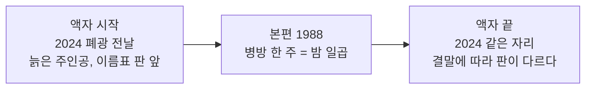
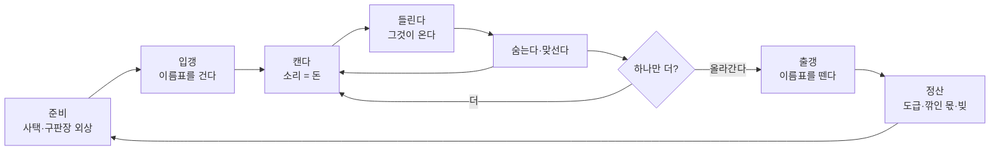
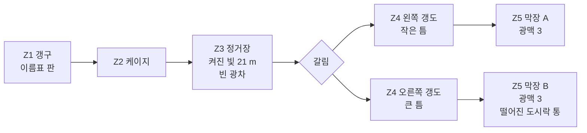
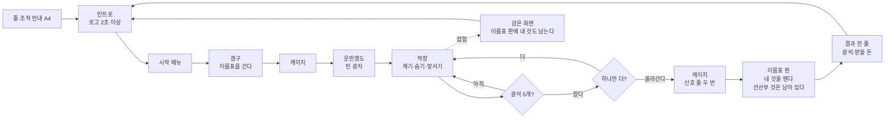
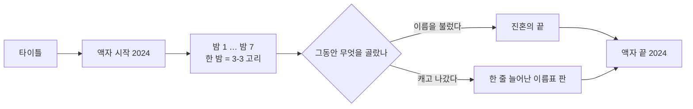
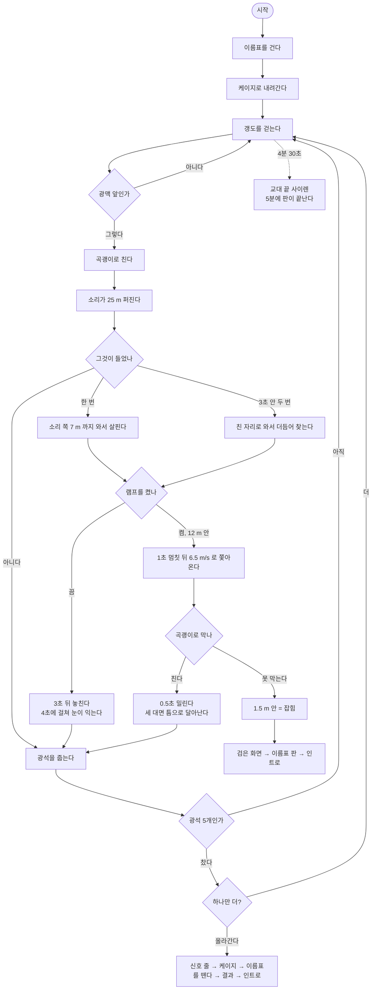
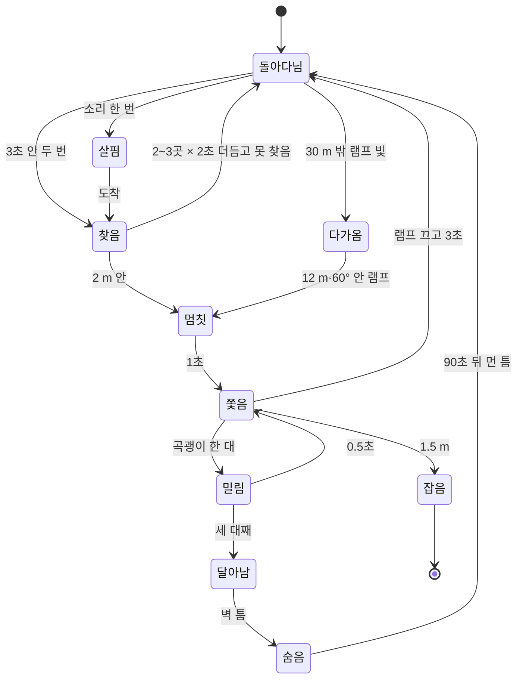

# 막장 — End of the Dead-End · 기획서 (원본)

초안 v2 · 2026-09-24 · **상태: 부스 한 판 = 후보 A 「하나만 더」, 세계관 네 가지의 큰 방향 확정(2-7, 사용자 09-24). 3~7절 구조·구역·흐름·도표 초안 — 사용자 판정 대기.**

**완성의 기준 (사용자 09-24)**: 게임성과 진행은 **세계관·스토리·플롯·내러티브** 네 가지를 플레이어와 시청자가 이해하고 그 세계에 빠져들면 완성이다. 공포를 주는 연출은 레퍼런스 게임을 보며 채울 수 있다 — 기획서는 네 가지에 힘을 쓴다.

발표용 웹 페이지(도표 그림 포함, v1 09-24): https://claude.ai/artifact/1S2degqNkBDmzJVV6edhGt — 원본 HTML 은 세션 작업 폴더에만 있다. 이 문서를 고치면 페이지도 다시 올린다.

이 문서가 원본이다. 발표용 웹 페이지와 지스타 제출용 2매(`../지스타2026/02_게임_기획서_초안.md`)는 여기서 뽑는다. 사실은 `조사/` 폴더(01~06, 영상 30편)에서만 가져오고, 줄마다 어느 문서인지 적는다. 게임 수치는 `Tunnel/unity/CLAUDE.md`·`docs/HANDOFF.md` 1절(판정 통과한 것)에서만 가져온다.

수업(게임기획실무)에서 가져온 틀:
- 스토리텔링 = 이야기 + 플레이어의 행동 + 선택 + 결과 + 변화
- 기획자의 5가지 질문 — 누구의 이야기인가 / 무엇을 원하나 / 왜 / 무엇이 방해하나 / 어떻게 변하나
- 플롯(왜 다음 일이 일어나나 = 인과)과 내러티브(그걸 어떻게 보여 주나)를 나눈다
- 클리프행어 — 가장 궁금한 순간에 끊는다
- 창조가 아니라 발견·재배치 — 소재를 많이 알아야 한다, 핍진성(그럴듯함)을 지킨다
- 만들 도표: 유저 플로우(전체 경험 흐름) · 인터랙션 다이어그램(시스템 반응 구조) · 플로우 차트 · 전체 구조와 구역 나누기

지킬 것:
- **실제 광업소 이름·실제 사고·실제 사람 이름은 쓰지 않는다.** 가상의 광업소로 하고, 실제에서는 풍습·작업 순서·환경만 가져온다(유족과 광부에 대한 예의).
- 지스타 전체 이용가 — 시신·피를 보이지 않는다(`../지스타2026/00_운영지침_분석과_일정.md` 2절).
- 핵심 문장 **"소리를 내야 돈이 벌리고, 소리를 내면 죽는다"** 에 기여하지 않는 것은 넣지 않는다(`CLAUDE.md`).

---

## 1. 조사에서 찾은 재료 — 발견과 재배치

조사하고 알게 된 가장 큰 것: **핵심 문장은 우리가 지어낸 규칙이 아니라 실제 광부들이 살던 규칙이었다.** 광부는 캔 만큼 돈을 받았고(도급제), 갱 안에서는 휘파람도 뛰기도 금지였다 — 굴이 무너지는 소리를 부른다고 믿어서.

오른쪽 칸 "게임에서 쓸 자리"는 제안이다. 아직 만들기로 정한 것이 아니다.

### 소리

| 찾은 사실 | 출처 | 게임에서 쓸 자리 (제안) |
|---|---|---|
| 갱 안에서 휘파람·뛰기 금지 — 굴이 무너지는 소리를 부른다고 믿었다 | 조사 01·02, 영상 10·16 | 핵심 문장의 실제 뿌리. 설명 글 대신 갱구 벽 표어 한 장 |
| 캔 만큼 받는 도급제, 광차 1톤을 0.8~0.9톤으로 깎아 셈(부비끼) | 조사 01 | "소리를 내야 돈이 벌리고"의 실제 뿌리 |
| 무너지기 전 동발(갱도 받침 기둥)이 먼저 운다 · 땅이 눌러 동발이 휘면 "짐이 온다" | 조사 02, 영상 10 | 괴물 말고 두 번째 경고 소리 — 나무 기둥이 갈라지는 소리 |
| 무너지기 전 천장에서 고운 탄가루가 떨어진다 — "이슬이 온다" | 조사 01·02·05 | 램프 빛 속에 떨어지는 가루 = 눈으로 보는 경고 |
| 칠레 붕괴의 소리 순서: 총소리 같은 소리가 잦아짐 → 우지끈 두 번 → 천둥 → 며칠 정적 → 먼 드릴 소리가 매시간 커짐 | 영상 20 | 무너짐 연출의 순서표 |
| 한국 막장 붕괴를 찍은 장면: "뜨겁다" 외침 → 동발 사이로 탄이 쏟아짐 → 가는 탄이 램프 빛 속으로 물줄기처럼 흘러내림 → 덮침 → 동발에 끼운 나무판까지 내려앉음 | 영상 06 | 무너짐 연출의 눈으로 보는 순서 |
| 착암기 소리에 사람 목소리가 묻힌다. 발파 전에 "발파 5초 전"을 외친다 | 영상 05·01, 조사 01 | — |
| 광부 아내는 빈 도시락 통이 달그락거리는 소리로 남편이 살아 온 것을 알았다 | 영상 27 | 한 판이 끝나는 소리 |
| 사택 스피커 음악이 뚝 끊기면 사고 · 밤에 울리는 구내전화 = 사고 소식 | 조사 01, 영상 10 | 인트로·결과 화면의 소리 |

### 빛

| 찾은 사실 | 출처 | 게임에서 쓸 자리 (제안) |
|---|---|---|
| 운반갱도(레일이 있는 큰 갱도)엔 주황 전등, 비탈 막장과 막장은 머리 램프뿐 | 조사 03, 영상 10·03 | 레벨 설계서 Step 5 "켜진 빛 / 죽은 등 / 완전 어둠" 셋과 그대로 맞는다 |
| 1956년 막장 밝기는 촛불 3~20개 정도. 석탄은 빛을 4% 만 되돌린다. 램프를 끄면 코에 댄 손도 안 보인다 | 조사 05 | 램프를 끄면 거의 아무것도 안 보이는 근거 |
| 어두운 갱도 멀리서 램프 불빛 십여 개가 사람 몸보다 먼저 다가온다 · 램프가 얼굴 반쪽만 비춘다 | 영상 09·23 | 괴물 "눈 두 점"과 같은 보이는 방식 |
| 안전등 신호: 고개를 위아래로 = "이리 와", 좌우로 = "오지 마" | 조사 03 | — |
| 발파 뒤 먼지 때문에 램프가 소용없고 화면이 하얗게 된다 | 영상 01·07·11 | — |
| 1994년 가스 사고 생존자: 새카만 연기 속에서 **레일을 발로 짚으며** 케이지까지 갔고, 작은 빨간 불이 구조대였다 | 영상 01 | 레벨 설계서 Step 2 "레일 = 돌아가는 단서"의 실제 증언 |

### 공간

| 찾은 사실 | 출처 | 게임에서 쓸 자리 (제안) |
|---|---|---|
| 갱구 → 수갱 케이지(세로 굴 승강기)·사갱 → 운반갱도(폭 3.3 · 높이 2.7 m, 레일, 옆에 물도랑) → 층("-300M" 표지) → 비탈 막장(기어 오름) → 막장(높이 1.8~2.4 m) → 버린 옛 갱도(가스가 고임) | 조사 03, 영상 11 | 3절 구역 나누기의 뼈대 |
| 갱도는 물 흐르는 방향을 따라 이어진다 — "길을 잃으면 물길을 거슬러 나와라" | 조사 01·03 | 레일 말고 두 번째 돌아가는 단서 |
| 갱도 입구·갈림길마다 층 이름, 갈래 이름, 갱구·수갱에서의 거리 표지(예: "437ML 1,262M") · 쇠 아치에 흰 페인트 번호 | 영상 10·06·17 | 글자가 아니라 세계 안 물건으로 된 길 안내 |
| 바람 문(풍문)은 항상 닫아 둔다 | 조사 03 | — |
| 버린 갱도는 물이 차오르고 레일에 녹물·주황 찌꺼기 | 영상 03·12 | 가장 깊은 구역의 모습 |
| 동발에 큰 호박만 한 곰팡이, 흰 솜 같은 것이 늘어짐 · 쥐가 도시락을 파먹어 천장에 매단다 | 조사 03, 영상 01·03·11 | 쉼터의 소품 |

### 몸

| 찾은 사실 | 출처 | 게임에서 쓸 자리 (제안) |
|---|---|---|
| 깊은 막장은 30~38도, 습도 90% — 한겨울에도 덥다 | 조사 05 | 지친 자세(UI-1b 헐떡임)의 이유 |
| 1 km 내려가도 기압은 수영장 1.2 m 수준 — 무서운 건 압력이 아니라 열·돌·가스 | 조사 05 | 깊이에 따라 바꿀 것은 더위와 공기이지 귀 먹먹함이 아니다 |
| 비탈 막장은 동발(60~80 kg)을 지고 엎드려 기어 올랐다 | 조사 02, 영상 14 | 숙이기 |
| 무너지면 굴 안에선 도망갈 데가 없어 엎드린다 | 영상 30 | — |

### 사람과 풍습

| 찾은 사실 | 출처 | 게임에서 쓸 자리 (제안) |
|---|---|---|
| 한 조 = 숙련공(선산부) 1 + 보조(후산부) 2. "후산부 목숨은 선산부 손에" | 조사 01 | 2절 이야기의 인물 |
| 갱구 벽에 이름표를 걸고 들어간다 | 조사 01·03 | 시작과 끝 장면 |
| 출근 때 "다녀오겠다"고 하지 않는다 · 들어갈 때 뒤돌아보지 않는다 · "오늘도 무사히" | 조사 01, 영상 04·28 | — |
| 사람이 죽은 막장에 다시 들어갈 때 철판을 두드리며 죽은 동료의 이름을 불러 "같이 나가자" | 조사 01 | 2절 후보 B |
| 쥐는 잡지 않는다 — 사고 전에 입구 쪽으로 도망가서 광부들이 따라 피했다 | 조사 01, 영상 16 | — |
| 광차 하나를 더 채우려고 혼자 남았다가 천장에 깔렸다(미국 광부 가족 이야기) | 영상 24 | 2절 후보 A 의 제목 |

---

## 2. 이야기 — 후보 셋 (5가지 질문)

셋 다 같은 조작(캔다 → 들린다 → 숨는다 → 맞선다 → 돌아온다)을 쓴다. 다른 것은 **왜 캐는지, 무엇을 두고 나오는지**다.

### 후보 A 「하나만 더」 — 후산부의 첫 밤 교대 (추천)

| 질문 | 답 |
|---|---|
| 누구의 이야기인가 | 탄광에 온 지 한 달 된 스무 살 후산부. 첫 밤 교대(밤 12시~아침 8시) |
| 무엇을 원하나 | 오늘 몫을 채운다 — 광석을 캐서 광차를 채워 올린다 |
| 왜 | 캔 만큼 받는다. 첫 월급은 두 달 뒤, 집에 보낼 돈. "딱 3년만 하고 나간다" |
| 무엇이 방해하나 | 같이 들어간 선산부가 막장에서 돌아오지 않았다. 곡괭이 소리가 돈인데 그 소리에 천장의 무언가가 온다. 동발이 운다 |
| 어떻게 변하나 | 광석을 세던 사람 → 광석을 두고라도 살아서 도시락 통을 흔드는 사람 |

- 플롯(인과): 캐야 돈 → 캐면 소리 → 소리에 그것이 옴 → 숨거나 맞섬 → 광석을 더 캘지, 지금 올라갈지 고름 → 케이지.
- 내러티브(보여 주는 법): 화면 글자 없음. 갱구 이름표 판, 기둥의 "오늘도 무사히", 막장에 떨어진 선산부의 안전등과 도시락 통, 소리.
- 클리프행어: 케이지가 올라와 이름표 판 앞에 서면 — 선산부의 이름표가 아직 걸려 있다. 판이 끝난다.
- 좋은 점: 핵심 문장과 한 글자도 안 부딪친다. 괴물이 광부 모양 몸이라 "저게 선산부인가?"라는 물음이 저절로 생긴다. 부스 한 판 3~5분에 들어간다.
- 어려운 점: 괴물이 누구인지 끝까지 말하지 않아야 한다. 말하는 순간 끊긴 이야기가 풀린다.

### 후보 B 「이름을 부르러」 — 진혼

| 질문 | 답 |
|---|---|
| 누구의 이야기인가 | 20년 차 선산부. 한 달 전 무너짐 때 후산부를 막장에 두고 혼자 나왔다 |
| 무엇을 원하나 | 그 막장에 다시 들어가 풍습대로 철판을 두드리며 이름을 부르고 "같이 나가자"고 한다 |
| 왜 | 갱구 판에 그 후산부의 이름표가 아직 걸려 있다. 데리고 나와야 뗄 수 있다 |
| 무엇이 방해하나 | 막장의 그것은 소리를 듣는다. 이름을 부르는 것 자체가 소리다 |
| 어떻게 변하나 | 도망쳐 나왔던 사람 → 끝까지 부르는 사람 |

- 좋은 점: "소리를 내야 한다"가 가장 강하게 이야기가 된다. 한국 탄광에만 있는 풍습이다.
- 어려운 점: 핵심 문장의 "돈"이 "사람"으로 바뀐다 — 광석을 캐는 이유가 약해진다. 죽음을 정면으로 다뤄 전체 이용가 문의가 더 필요하다.

### 후보 C 「마지막 교대」 — 문 닫기 전날

| 질문 | 답 |
|---|---|
| 누구의 이야기인가 | 문 닫기 전날 마지막 밤 교대에 남은 광부 |
| 무엇을 원하나 | 마지막 몫을 채우고 자기 이름표를 떼고 나간다 |
| 왜 | 내일이면 광업소가 닫힌다. 이 일로 자식을 키웠다 |
| 무엇이 방해하나 | 전등이 하나씩 꺼진 갱도, 차오르는 물, 그리고 오래 여기 남아 있던 것 |
| 어떻게 변하나 | 떠나는 사람 → 기억하는 사람 |

- 좋은 점: 2024·2025년 실제 폐광과 이어져 그럴듯하고 지금 이야기다. "전등이 꺼져서"가 어둠의 이유가 된다.
- 어려운 점: "여기 남아 있던 것"이 실제 폐광 광부에게 무례하게 읽힐 수 있다(가상 광업소로 해도).

### 2-1. A 와 B 자세히 (사용자 요청 09-24)

배경은 둘 다 같다: 1988년 강원도의 가상 탄광(2-7 에서 확정). 나무 동발과 전기 캡램프를 쓰던 때(조사 01·03).

#### A 「하나만 더」 — 한 판 따라가기 (약 4분)

1. **갱구, 밤 (0:00~0:20)** — 갱구 벽의 이름표 판. 내 이름표를 빈 칸에 건다. 바로 옆 칸에 선산부의 이름표가 먼저 걸려 있다 — 한 시간 먼저 들어갔다. 기둥에 "오늘도 무사히". 램프를 켠다.
2. **케이지 (0:20~0:40)** — 철창 승강기. 신호 벨이 두 번 울리면 내려간다(실제 신호: 한 번 정지, 두 번 출발 — 조사 03). 쇠줄 감기는 소리, 철창 너머로 층 표지가 올라간다.
3. **운반갱도 (0:40~1:00)** — 주황 전등이 이어지고 레일 옆으로 물이 흐른다. 빈 광차 하나가 서 있다 = 오늘 채울 몫. 여기까지는 밝고 조용하다.
4. **막장 쪽 (1:00~3:30)** — 전등이 끝나고 머리 램프뿐. 막장 입구 바닥에 선산부의 도시락 통이 떨어져 있다. 뚜껑이 열렸고 밥이 그대로다 — 점심 전에 무슨 일이 있었다. 광맥을 치면 소리가 갱도를 울리고, 멀리 천장에서 무언가 긁는 소리. 동발이 삐걱 운다. 램프를 끄면 어둠 속에 빛 두 점.
5. **고르기** — 광석 5개를 광차에 실으면 몫이 찬다. 그때부터 케이지로 돌아갈 수 있다. 더 실을수록 받을 돈은 오르지만(도급), 하나 더 캘 때마다 그것이 더 자주, 더 가까이 온다. "하나만 더"를 할지 지금 올라갈지는 플레이어가 고른다.
6. **끝 (~4:00)** — 신호 줄을 두 번 당겨 올라간다. 이름표 판 앞에서 내 이름표를 뗀다. 선산부의 이름표는 그대로 걸려 있다. 검은 화면에 "광석 N개 · 받을 돈" 한 줄, 그리고 끝.
   - **잡혔을 때** — 검은 화면 뒤 이름표 판. 내 이름표도 선산부 옆에 걸린 채 남아 있다. 피나 시신 없이 "돌아오지 못했다"를 보여 준다.

- 플레이어에게 말하지 않는 뒤편(플롯): 선산부는 한 시간 먼저 들어가 막장을 준비하다 무언가를 봤고 도시락 통을 떨어뜨렸다. 그 뒤는 모른다.
- 괴물: 광부 모양 몸이 천장을 긴다. 게임은 그것이 선산부인지 말하지 않는다. 플레이어가 도시락 통·이름표·괴물의 몸을 보고 스스로 짐작한다. 짐작이 맞는지 알려 주지 않고 끊는 것이 클리프행어.
- 변화는 말로 알려 주지 않는다. "하나 더"를 누르거나 멈추는 플레이어의 손이 변화다.
- 이미 있는 것: 캐기, 소리를 듣는 괴물(의심·수색·추격·잡기), 램프와 어둠 적응, 곡괭이 치기·던지기·부러짐, 발소리, 인트로와 잡힌 뒤 인트로 복귀.
- 새로 만들 것 — 부스 규칙에 이미 있던 것: 케이지(리프트), 광석 5개 몫, 결과 한 줄. A 때문에 더하는 것: 갱구 이름표 판(시작·끝·잡힘에 세 번 쓰임), 광차에 광석 싣기, 도시락 통 소품 하나. **조작 키는 늘지 않는다.**
- 걱정: 괴물 정체를 말하고 싶어질 때 참아야 한다. 관람객이 4분 안에 알아채려면 이름표 판이 시작과 끝에 두 번 보여 비교가 돼야 한다.
- 전시 뒤: 다음 날 밤, 선산부를 찾아 더 깊은 층으로.

#### B 「이름을 부르러」 — 한 판 따라가기 (약 4분)

뒤편: 한 달 전 막장이 무너질 때 선산부는 무너지는 소리에 먼저 뛰었고, 뒤에 있던 후산부는 나오지 못했다. 광업소는 구조를 멈추고 그 막장을 바람 문으로 막았다.

1. **갱구** — 이름표 판에 후산부 이름표가 한 달째 걸려 있다. 내 이름표를 그 옆에 건다.
2. **케이지, 운반갱도** — A 와 같다.
3. **막아 둔 옛 막장** — 바람 문을 열고 들어간다. 전등 없음, 레일에 녹물, 발목까지 물(영상 03·12).
4. **할 일** — 막장 안에 슈트 철판(탄이 미끄러져 내려가는 철판)이 세 군데. 곡괭이로 철판을 두드리면 소리가 갱도 끝까지 울린다(실제 풍습: 이름을 부르며 철판을 두드린다 — 조사 01). 두드리면 어딘가에서 "똑, 똑" 대답이 돌아온다 — 다음 철판이 있는 쪽. 대답을 따라가야 한다. 그런데 두드리는 소리는 그것도 부른다. 곡괭이 캐기는 "무너진 곳을 파서 길을 여는 일"로 바뀐다. 돈은 없다.
5. **마지막 철판** — 세 번째를 두드리면 대답이 바로 등 뒤에서 들린다(클리프행어).
6. **끝** — 케이지로 돌아와 후산부의 이름표를 뗀다. 데리고 나왔는지는 말하지 않는다. 아무도 안 당겼는데 신호 벨이 한 번 더 울린다.
   - **잡혔을 때** — 두 이름표가 나란히 남는다.

- 괴물: 거의 대놓고 후산부를 떠올리게 한다. 대답하는 두드림이 그것인지 후산부인지 모른다.
- 새로 만들 것: 철판 두드리기, **대답하는 두드림 소리가 방향을 알려 주는 장치(새 시스템)**, 막아 둔 옛 막장 구역(물·녹), 등 뒤 대답 연출.
- 핵심 문장이 바뀐다: "소리를 내야 데려오고, 소리를 내면 죽는다". `CLAUDE.md` 의 기능 판정 기준을 고쳐야 하고, 돈 쪽 계획(곡괭이는 상점에서 산다 — UI-1a 결정)이 붕 뜬다.
- 걱정: 10/17 빌드까지 새 장치를 만들고 판정받아야 한다. 죽은 동료를 부르는 게 중심이라 전체 이용가 문의에서 A 보다 걸릴 수 있다. 풍습을 모르는 관람객에게 30초 안에 "왜 철판을 두드리지?"가 전해지기 어렵다.

#### A 와 B 나란히

| | A 하나만 더 | B 이름을 부르러 |
|---|---|---|
| 핵심 문장 | 그대로 | "돈"이 "사람"으로 바뀜 |
| 새로 만들 것 | 이름표 판·광차 싣기·소품 하나 | 위 + 대답하는 두드림 장치·옛 막장 구역 |
| 30초 안에 전해지나 | "캐면 온다"가 바로 | 풍습 설명이 필요할 수 있음 |
| 남는 감정 | 궁금함 (선산부는 어디에?) | 슬픔·죄책감 |
| 전체 이용가 | 쉬움 | 문의 필요 |
| 전시 뒤 이어짐 | 선산부를 찾는 다음 밤 | — |

잇는 길 하나: 부스 한 판은 A, 전시 뒤 이야기로 B. A 의 후산부가 20년 뒤 선산부가 되어 그 막장에 다시 들어가는 이야기로 이어진다.

**결정 (09-24)**: 부스에서 보일 부분은 A. 출시하려면 세계관·스토리·플롯·내러티브를 짜야 한다 → 2-2~2-6.

---

## 2-2. 세계관 (초안)

수업의 정의: 세계관은 배경 그림이 아니다(월드빌딩) — 그 세계의 규칙·역사·장소·사람. 관심을 가지면 행동하게 된다.

### 한 줄

**산은 소리를 듣는다. 산에서 나오지 못한 광부는 산에 남아, 살아 있던 때의 버릇대로 움직인다.**

### 때와 곳 — 1988년, 강원도의 가상 탄광 「귀령광업소」

- 이듬해(1989) 석탄산업 합리화로 탄광 대부분이 문을 닫는다(1988년 347곳 → 1996년 11곳, 조사 01). 그래서 회사는 닫기 전에 한 톤이라도 더 캐려 하고, 사고는 적지 않으려 한다 — **이 회사의 속셈은 설정(지어낸 것)이다.** 실제 광업소 이야기가 아니다.
- 1988년은 진폐로 죽은 광부(212명)가 사고로 죽은 광부(159명)보다 많아진 해다(조사 02).
- 전기 캡램프, 나무 동발, 기어 오르는 비탈 막장이 아직 남아 있던 때(조사 03·05). 헤드램프 하나로 걷는 우리 게임과 맞는다.

### 세계의 규칙 — 괴물이 왜 그렇게 움직이나

이미 만든 괴물의 행동을 하나씩 실제 광부의 버릇에 대어 보면 전부 맞는다. **괴물의 행동은 새로 지어낸 것이 아니라 광부의 버릇이 뒤틀린 것**으로 설명된다.

| 이미 만든 괴물의 행동 | 실제 광부의 버릇 (조사) | 이 세계의 설명 |
|---|---|---|
| 소리가 나면 그쪽으로 온다 | 갇힌 광부는 두드려서 구조를 불렀고(조사 02 새고, 영상 20), 산 사람은 죽은 동료의 이름을 부르며 철판을 두드렸다(조사 01) | 소리를 "누가 나를 부른다"로 알아듣고 찾아온다 |
| 켜진 램프에 다가온다 | 어둠에서는 사람 몸보다 동료의 불빛이 먼저 보였고(영상 09), 연기 속 작은 빨간 불이 구조대였다(영상 01) | 불빛을 동료로 알고 따라온다 |
| 손으로 바닥·벽을 더듬어 찾는다 | 발파 바람에 등불이 꺼지면 벽을 더듬으며 기어 다녔다(조사 05) | 불이 꺼진 채 남은 몸의 버릇 |
| 천장을 긴다 | 비탈 막장을 동발을 지고 엎드려 기어 올랐다(조사 02) | — |
| 곡괭이에 맞으면 움찔하고 벽 틈으로 물러난다 | 무너진 막장 = 갇혔던 곳 | 사람이었던 몸. 돌아가는 곳은 무너진 틈 |
| 붙잡는다 | 진혼 때 "같이 나가자"고 불렀다(조사 01) | 같이 나가자고 붙잡지만 그들은 나갈 수 없다. **잡힌 사람도 산에 남는다 — 이름표가 판에 남는다** |
| 어둠 속 눈 두 점 | 1970년대 캡램프는 보조 불빛이 2개였다(조사 05) | (해석 하나) 꺼져 가는 램프의 두 불빛일 수도 있다. 정하지 않는다 |

규칙 넷:
1. **산은 소리를 듣는다.** 휘파람 금기는 미신이 아니었다.
2. **나오지 못한 사람은 산에 남는다.** 이름표가 판에 남은 사람들이다.
3. **남은 사람은 살아 있던 버릇대로 움직인다.** 부르면 오고, 불빛을 따르고, 어둠에선 더듬는다.
4. **이름을 불러 주면 —** 결말에서 밝혀지는 규칙(2-6).

### 사람들

| 누구 | 무엇 | 조사 근거 |
|---|---|---|
| 주인공 **이동수** | 1968년생, 스무 살 후산부. 집에 보낼 돈 때문에 왔다. "딱 3년만" | 조사 01 |
| 선산부 **임만수** | 20년 차, 주인공의 사수. 이름 만수(萬壽) = "오래 살라" — 그 이름의 사람이 막장에 남는다. 결말에서 부르는 이름. "막장일도 아비를 잘 만나야 한다" — 주인공에게 아버지 같은 사람. 첫 밤에 사라진다 | 조사 01 |
| 반장 | 흰 안전모('백바가지'). 회사 쪽. 몫과 단가를 정하고 사고를 적지 않는다 | 조사 01 |
| 사택의 가족 | 도시락을 싸 주고, 출근하면 신발을 방 안쪽으로 돌려놓는다. 얼굴은 안 나온다 — 소리와 물건만 | 조사 01, 영상 27 |
| 그것들 | 나오지 못한 광부들 | — |

### 돈 — 게임의 경제가 실제 구조를 따른다

- 실제: 캔 만큼 받는다(도급), 광차 무게를 깎아 센다(부비끼), 월급 대신 쌀 전표, 광업소 신분증으로 가게 외상(조사 01).
- 게임: 광석 = 돈. 곡괭이·램프 배터리는 광업소 구판장에서 외상으로 산다(곡괭이는 상점에서 산다 — UI-1a 결정). 빚이 남으면 다음 밤에도 들어가야 한다. **소리를 내야 빚을 갚는다.**

### 장소 (4절 구역 나누기의 뼈대)

사택 → 갱구(이름표 판·안전등실) → 케이지 → 층들(깊을수록 오래되고 덥다, 조사 05) → 막아 둔 옛 갱도(물이 차고 녹이 슨다, 영상 03) → 막장의 끝.

## 2-3. 스토리 — 무슨 일이 있었나 (일어난 순서대로)

1. **개광** — 산신제를 지내고 갱구를 연다(조사 01: 새 갱구를 열 때 돼지머리 산신제).
2. **수십 년** — 이틀에 한 명꼴로 죽는다(실제 1978~87년 비율, 조사 01). 나오지 못한 사람의 이름표가 판에 쌓인다.
3. **어느 해의 큰 붕락** — 가장 깊은 막장이 무너져 한 조가 갇힌다. 두드리는 소리가 들리는데도 회사는 구조를 멈추고 바람 문으로 막는다. 사고는 기록되지 않는다. (설정. 실제 사고를 옮긴 것이 아니다)
4. **그 뒤** — 갱 안의 소리에 "대답"이 오기 시작한다. 광부들 사이에 휘파람·뛰기 금기가 굳는다.
5. **1988년 봄** — 합리화를 앞두고 회사가 단가를 올려 더 깊이, 더 많이 캐게 한다.
6. **주인공이 온다** — 한 달 뒤 첫 밤 교대. 선산부가 사라진다. **(부스 한 판 = 여기)**
7. **이어지는 밤들** — 주인공은 빚과 선산부 때문에 계속 들어간다. 층을 내려갈수록 선산부의 흔적과 옛 사고의 흔적이 나온다.
8. **막장의 끝** — 막아 둔 가장 깊은 막장에 닿는다.
9. **결말** — 2-6.

## 2-4. 플롯 — 왜 그렇게 이어지나

수업의 정의: 플롯은 "왜 다음 일이 일어났나"(인과). 사건만 늘어놓으면 플롯이 아니다.

빚이 있다. **그래서** 탄광에 온다. 캔 만큼 받으니 **그래서** 더 캐야 한다. 캐면 소리가 난다. 그것들은 소리를 부름으로 듣는다. **그래서** 선산부가 끌려간다. **그런데** 주인공은 빚 때문에 그만둘 수 없다. **그래서** 다음 밤에 또 들어간다. 회사는 닫기 전에 더 캐려고 단가를 올린다. **그래서** 더 깊이, 더 시끄럽게 캔다. **그래서** 더 오래된 그것들이 깬다. 주인공은 막아 둔 막장이 사고를 숨긴 자리라는 걸 알게 된다. **그래서** 돈이 아니라 사람을 데리러 막장의 끝으로 간다.

전환점(이야기가 꺾이는 곳) 셋 — 제안:
1. **선산부가 사라진다** — 첫 밤(부스 한 판).
2. **반장이 선산부의 이름표를 판에서 떼어 버린다** — 회사가 없던 일로 만든다. 주인공이 그 이름표를 주머니에 넣는다. 이때부터 목적이 "몫"에서 "선산부"로 옮겨 가기 시작한다.
3. **막장의 끝에서, 대답하는 두드림이 사람의 신호 박자라는 걸 안다** — 그것들이 무엇이었는지 알게 되는 곳.

## 2-5. 내러티브 — 어떻게 보여 주나

수업의 정의: 내러티브는 "그것을 나에게 어떻게 이야기해 주나". 같은 플롯도 보여 주는 순서와 눈(시점)에 따라 다른 이야기가 된다.

원칙: **화면 글자 0**(UI-1c 판정 통과). 말로 설명하는 사람 없음. 전하는 것은 물건·소리·빛·공간.

| 전하는 도구 | 무엇을 전하나 | 근거 |
|---|---|---|
| 이름표 판 (매 밤 처음과 끝) | 누가 아직 안에 있나. 밤마다 바뀐다 | 조사 01 |
| 사택 스피커 | 아침 음악 = 무사히 끝난 밤. 음악이 뚝 끊김 = 사고 | 조사 01 |
| 도시락 통 | 흔들면 살아 왔다. 떨어진 도시락 = 무슨 일이 있었다 | 영상 27 |
| 갱도 표지 (층·거리) | 얼마나 깊이 왔나 | 영상 10·06 |
| 쉼터 벽의 분필 숫자 | 누가 광차 몇 대를 캤나 — 깎인 몫 | 영상 11 |
| 반장 사무실의 사고 기록부 | 빈 줄 = 적지 않은 사고 | (제안) |
| 소리 — 두드림, 동발 울음, 쥐의 발소리 | 경고와 대답 | 조사 02 |

짜임: **한 판 = 한 교대(밤).** 판과 판 사이 = 사택과 갱구(짧은 쉼 장면). 매 판의 끝은 클리프행어 하나 — 이름표 판이 무언가 바뀌어 있다.

보여 주는 순서, 두 가지 중 고른다:
- **시간 순서** — 주인공과 같은 속도로 알게 된다. 단순하고 부스 한 판과 그대로 이어진다.
- **액자식**(수업: 이야기 속 이야기) — 2024년 폐광 전날, 늙은 주인공이 마지막으로 이름표 판 앞에 서는 장면으로 시작하고 끝난다. 1988년의 밤들은 그 사이 회상. 실제 2024·2025년 폐광과 이어진다(후보 C 의 좋은 점을 여기서 쓴다).

## 2-6. 결말 — 후보

- **이름을 부른다** (후보 B 의 진혼) — 막장의 끝에서 판에 남은 이름들을 철판을 두드리며 불러 준다. 규칙 4 가 밝혀진다. 광석은 가져갈 수 없다.
- **캐고 나간다** — 광석을 가득 싣고 나간다. 빚은 갚지만 이름표 판에 한 줄이 늘어난다.
- 플레이어가 그동안 무엇을 골랐는지(몫을 더 캤나, 멈췄나)로 갈린다 — 수업: 스토리텔링 = 이야기 + 행동 + 선택 + 결과 + 변화.

## 2-7. 정한 것 (사용자 09-24)

1. 때 = **1988년**
2. 그것들의 정체 = **결말에서 밝힌다**. 부스와 앞 부분은 짐작만
3. 보여 주는 순서 = **액자식** (2024 폐광 전날로 시작하고 끝난다)
4. 결말 = **고른 것으로 갈린다** (이름을 부르는 끝 / 캐고 나가는 끝)
5. 이름 = **귀령광업소**(耳嶺, 귀 고개 — "산은 소리를 듣는다". 소리로는 鬼靈으로도 읽힌다) · 주인공 **이동수** · 선산부 **임만수**. 광업소 이름은 간단한 검색에서 같은 이름의 실제 광업소를 못 찾았다 — 지스타 제출 전에 한 번 더 확인. (후보였던 "흑령"은 북한에 실제 흑령탄광이 있어 뺐다)

---

## 3. 전체 구조

표기: **판정 통과** = 실행 파일로 사용자 판정을 받은 수치(`HANDOFF.md` 1절). **제안** = 아직 안 만든 것.

### 3-1. 액자와 본편

- **밤 일곱인 이유**: 실제 교대는 한 주마다 바뀌었다(갑방 → 병방 → 을방, 조사 01). 병방 한 주 = 밤 일곱.
- 부스 한 판 = 밤 1 을 줄인 것. 액자 장면은 부스에 넣지 않는다(3~5분 안에 안 들어간다).

### 3-2. 일곱 밤 — 3막 (제안)

| 밤 | 막 | 어디까지 내려가나 | 플레이어가 새로 아는 것 | 새 위험 | 끝의 클리프행어 |
|---|---|---|---|---|---|
| 1 | 1막 | 1편(첫 층) | 캐면 온다. 램프를 끄면 산다 | 그것 | 선산부의 이름표가 남아 있다 **(부스 한 판)** |
| 2 | 1막 | 1편 깊은 쪽 | 동발이 울면 무너진다. 쥐가 도망가는 쪽이 살길 | 무너짐 | 아침 스피커 음악이 뚝 끊긴다 |
| 3 | 2막 | 2편 | 선산부의 안전등을 줍는다 | 더위(깊을수록, 조사 05) | 반장이 선산부 이름표를 뗀다 — 주인공이 주머니에 넣는다 **(전환점 2)** |
| 4 | 2막 | 2편 + 옛 갱도 입구 | 반장 사무실 사고 기록부의 빈 줄 | 가스(바닥에 고인다, 조사 05) | 바람 문 너머에서 두드림이 대답한다 |
| 5 | 2막 | 3편 | 막아 둔 막장 = 숨긴 사고 자리 | 물(차오른다) | 단가가 오르고, 이름표 판에 새 이름표 둘이 남는다 |
| 6 | 3막 | 막아 둔 옛 갱도 | 두드림 = 사람의 신호 박자 **(전환점 3, 정체를 안다)** | 전부 | — |
| 7 | 3막 | 막장의 끝 | 규칙 4 | — | 결말이 갈린다 → 액자 끝 |

### 3-3. 한 밤의 고리 (핵심 고리)

부스 한 판은 이 고리를 한 바퀴만 돈다(준비·정산은 결과 한 줄로 줄인다).

## 4. 구역 나누기

실제 갱도 순서(조사 03)를 그대로 따른다. 레벨 설계서 Step 5 의 빛 셋(켜진 빛 / 죽은 등 / 완전 어둠)이 실제와 맞는다(운반갱도엔 전등, 막장엔 머리 램프뿐 — 조사 03, 영상 10).

| 구역 | 실제 근거 | 빛 | 소리 | 위험 | 얻는 것 | 숨는 곳 | 이야기 도구 | 부스 |
|---|---|---|---|---|---|---|---|---|
| Z0 사택 | 10평 안 되는 집, 스피커 (조사 01) | 밝음 | 스피커 음악 | 없음 | — | — | 도시락, 돌려놓은 신발 | — |
| Z1 갱구 | 이름표 판, 안전등실, "오늘도 무사히" (조사 01, 영상 04) | 밝음 | 권양기 | 없음 | 외상(구판장) | — | 이름표 판, 사고 기록부 | ✓ 짧게 |
| Z2 케이지 | 수갱 승강기, "-300M" 표지 (영상 11) | 철창 사이 불빛 | 쇠줄, 신호 벨 | 없음 | — | — | 층 표지 | ✓ 짧게 |
| Z3 운반갱도 | 폭 3.3·높이 2.7 m, 레일, 물도랑, 주황 전등 (조사 03) | 켜진 빛 / 죽은 등 | 물 흐름, 광차 | 낮음 | 빈 광차(몫) | 광차 뒤 | 레일 = 돌아가는 길 | ✓ 정거장 앞 21 m |
| Z4 옆 갱도 | 레일 없는 갈림길, 갈림길 표지 (영상 06·10) | 완전 어둠 | 발소리 울림 | 중간 — 길을 잃는다 | 광맥 | 작은 틈 | 갈림길 표지, 분필 숫자 | ✓ |
| Z5 막장 | 높이 1.8~2.4 m, 동발 촘촘, 35도 넘음 (조사 03·05) | 머리 램프뿐 | 동발 울음, 이슬 | 높음 — 막다른 곳 | 광맥 많음 | 없음 | 떨어진 도시락 통 | ✓ 광맥 6곳 |
| Z6 비탈 막장 | 엎드려 기어 오름 (조사 02) | 머리 램프뿐 | 숨소리 | 중간 | 광맥 | 숙여야 들어가는 틈(폭 0.9·높이 1.3 m, 판정 대기) | — | — |
| Z7 막아 둔 옛 갱도 | 바람 문 뒤, 물·녹·곰팡이, 이산화탄소 고임 (조사 03·05, 영상 03) | 완전 어둠 | 물방울, 두드림 | 매우 높음 | 이야기 | 없음 | 두드림, 오래된 이름 | 밤 4~ |
| Z8 막장의 끝 | — (설정) | 완전 어둠 | 이름을 부르는 소리 | — | 결말 | — | 이름표 전부 | 밤 7 |

- 그것이 드나드는 **큰 틈**(높이 2.6 · 폭 1.35 m)은 Z4·Z5 에, 플레이어만 들어가는 **작은 틈**은 Z4·Z6 에 둔다 — 이미 만든 R2 맵(조각 1·5 큰 틈, 조각 3 작은 틈, 사용자 판정 대기).
- 깊을수록: 덥다(운반 29도 → 막장 33~38도, 조사 05), 공기가 나쁘다, 오래된 그것이 있다. **기압은 거의 안 변한다**(1 km 에 수영장 1.2 m, 조사 05) — 귀가 먹먹한 연출은 쓰지 않는다.

### 4-1. 부스 한 판의 지도 (제안)

- 갱도 전체 60~80 m, 광맥 6곳, 목표 광석 5개(지스타 초안 4절). 지금 판정용 복도는 조각 6개 = 42 m.

## 5. 유저 플로우 — 전체 경험 흐름

### 5-1. 부스 관람객 (3~5분)

감정의 높낮이(제안): 갱구 0 → 케이지 1 → 운반갱도 1 → 막장 첫 곡괭이 3 → 첫 긁는 소리 6 → 마주침 9 → 광석 5개 4 → "하나만 더" 7 → 케이지 2 → 이름표 판 5(끊긴 이야기).

### 5-2. 출시판

## 6. 플로우 차트 — 부스 한 판의 판단 흐름

- 괴물의 수치는 전부 **판정 통과**(M3·M4·M5·M6). 이름표·케이지·광차 싣기·교대 끝 사이렌은 **제안**.
- 교대 끝 사이렌 = 지스타 초안의 "한 판 최대 5분"(줄 관리)을 이야기 안의 물건으로 바꾼 것.

## 7. 인터랙션 다이어그램 — 시스템 반응 구조

### 7-1. 플레이어가 하면, 세계가 이렇게 답한다

| 플레이어가 하는 것 | 세계에 생기는 것 | 그것의 반응 | 플레이어가 받는 신호 (화면 글자 없이) |
|---|---|---|---|
| 걷기 · 달리기 · 숙이기 | 발소리 6 · 14 · 2 m | 12 m 안 달리기를 들으면 살피러 온다 | 내 발소리의 크기 |
| 곡괭이로 광맥 치기 | 타격 소리 25 m, 광석 | 한 번 = 소리 쪽 7 m 까지 / 3초 안 두 번 = 그 자리로 | 돌 부서지는 소리, 먼지, 굴러 나온 광석 |
| 곡괭이 던지기 | 떨어진 자리에 소리 20 m | 돌아다니거나 찾는 중이면 그쪽으로 간다(쫓는 중엔 무시) | 멀리서 떨어지는 소리 |
| 램프 끄기 | 내 빛이 사라진다 | 3초 뒤 나를 놓친다 | 4초에 걸쳐 눈이 익고, 어둠 속 눈 두 점 |
| 램프 켜기 | 빛 30 m · 원뿔 14 m | 30 m 밖 빛 = 2.5 m/s 로 다가온다 / 12 m·60° 안 = 1초 멈칫 뒤 6.5 m/s 로 쫓아온다 | 램프 빛에 걸린 그것 |
| 곡괭이로 그것을 치기 | 한 대 25, 0.5초 밀림 | 세 대째 = 벽 틈으로 달아나 90초 뒤 먼 틈에서 나온다 | 살에 맞는 소리 |
| 오래 달리기 | 숨이 찬다 | — | 시야가 숙고 흔들린다, 숨소리 |
| 곡괭이 30번 치기 | 곡괭이가 닳는다 | — | 떨림(15 이하) → 손에서 부서진다 |
| **이름표 걸기·떼기 (제안)** | 판의 칸이 바뀐다 | — | 판 = 누가 안에 있나 |
| **광차에 광석 싣기 (제안)** | 몫이 찬다 | — | 광차 속 광석 더미의 높이 |
| **신호 줄 두 번 (제안)** | 케이지가 올라간다 | 줄 소리도 소리다(제안) | 벨 두 번 |

핵심 문장이 이 표 한 장이다: 돈이 되는 행동(치기)은 전부 소리를 만들고, 소리는 전부 그것을 부른다.

### 7-2. 그것의 반응 구조 (판정 통과한 상태들)

세계관으로 읽기(2-2): 살핌·찾음 = 부름을 찾아오는 것, 다가옴 = 동료의 불빛을 따라오는 것, 더듬기 = 불 꺼진 몸의 버릇, 잡음 = "같이 나가자".

## 8. 지스타 2매로 줄이기

`../지스타2026/02_게임_기획서_초안.md` (09-24 개정). 이 문서의 1·2-2·3-3·4-1·5-1 을 줄였다.
